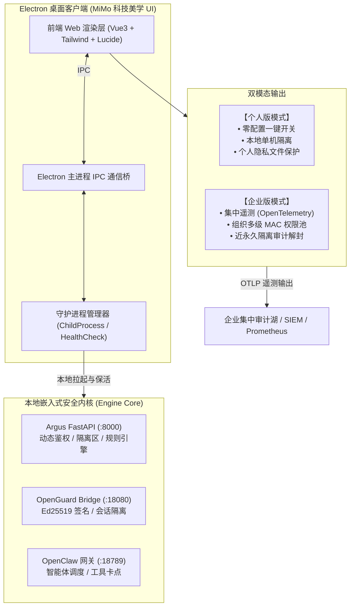

# Argus 桌面客户端（Electron）包装与演进路线规划书 (已定案)

---

## 一、 项目背景与演进愿景

在前序工作中，团队已经成功跑通了涵盖 **OpenGuard（用户网关与管理后台）↔ Bridge ↔ OpenClaw（智能体）↔ Argus（访问控制/IO/沙箱/审计）** 的完整四层服务链条，并在真实 Chrome 浏览器下验证了多租户身份对齐、多级 MAC 鉴权、动态防线提级及近永久隔离等核心能力。

根据团队沟通与用户决策，新项目的核心目标是：**将上述一整套底层服务端与安全能力包装为一个面向最终用户的桌面级 Electron 应用**，借鉴小米智能生态（`https://mimo.mi.com/`）的高美感现代科技 UI 风格，提炼专属 `mimo-ui-skill`，形成支持“个人版轻量部署”与“企业版遥测审计”的双模态安全中控产品。

---

## 二、 架构决策与选型定案矩阵（已确认）

| 决策维度           | 选定方案                           | 详细落地方案                                                                                                                                         |
|:-------------- |:------------------------------ |:---------------------------------------------------------------------------------------------------------------------------------------------- |
| **客户端宿主形态**    | **选项 A：全功能桌面守护 (Daemon Host)** | Electron 主进程通过 `child_process` 充当守护进程。用户双击启动客户端时，自动静默拉起后台 Python FastAPI (:8000)、Bridge (:18080) 与 OpenClaw (:18789)；退出客户端时优雅杀掉子进程，真正实现“开箱即用”。 |
| **个人版功能边界**    | **单机免登录极简中控**                  | 隐藏复杂的多用户切换与组织层级，采用单机默认管理员模式；提供“核心防御总开关”、“一键拦截敏感路径”（`.gitconfig`, `.env`, 私钥文件等）勾选卡片、大模型 API Key 快速填报。                                          |
| **企业版遥测标准**    | **OpenTelemetry (OTLP) 最优解**   | 采用行业通用 OpenTelemetry (OTLP JSON/HTTP) 标准协议 + 本地故障缓冲队列，支持无缝导出至企业 Prometheus / Datadog / Grafana / 集中日志审计湖 (SIEM)。                               |
| **企业版管理继承**    | **100% 完整保留 v7 核心能力**          | 完整保留并无缝迁移已实装的“四级密级分配（public ~ top_secret）”、“用户/资源规则在线可视化修改”及“近永久隔离区工单审批解封”面板。                                                                  |
| **前端技术栈选型**    | **方案 A：现代轻快主流**                | `Electron + Vite + Vue 3 + Tailwind CSS + Lucide 图标`。体积小、启动快、响应极其灵动，天然契合小米 MiMo 风格的卡片式流体交互。                                                    |
| **Skill 提炼方向** | **方向 A：MiMo UI 设计系统生成 Skill**  | 提炼专门的 `mimo-ui-skill`（包含调色板 Token、Bento 卡片组件模板、状态徽章、流式卡片等）。后续让 AI 写任何新界面，挂载该 Skill 即可自动产出符合小米审美的界面。                                            |
| **既有服务迁移策略**   | **直接作为嵌入式引擎库 (Engine Core)**   | 直接复用当前跑通的 `argus/`、`openguard/`、`openclaw_adapter/` 作为桌面客户端底层的 Engine Core，不重写核心业务逻辑，避免重复造轮子。                                              |

---

## 三、 产品双模态架构设计



---

## 四、 MiMo 视觉风格特征与设计规范

参考 `https://mimo.mi.com/` 的视觉语言，确立核心设计规范：

### 4.1 视觉调色板与材质 Token

* **中性底色**：
  * 深色模式：极黑背景 `#0a0b0e`，卡片表面 `#14171f`，悬浮层 `#1d212c`；
  * 浅色模式：柔白背景 `#f8f9fa`，卡片表面 `#ffffff`，悬浮层 `#f1f3f5`；
* **微质感表面（Micro-Glassmorphism）**：
  * `backdrop-filter: blur(16px)`
  * `border: 1px solid rgba(255, 255, 255, 0.08)`（深色态）/ `border: 1px solid rgba(0, 0, 0, 0.06)`（浅色态）
* **功能状态色彩**：
  * **小米暖橙 (Mi Accent)**：`#ff6900`（强调与品牌高亮）；
  * **合规防御绿 (Safe Green)**：`#00b42a`（系统运转健康，鉴权合规）；
  * **越权阻断红 (Danger Red)**：`#f53f3f`（卡点拦截触发，高危阻断）；
  * **审核挂起黄 (Review Amber)**：`#ff7d00`（防线提级，等待人工确认）。

### 4.2 核心视窗规划

1. **中控状态总览（Bento Dashboard）**：
   * 呼吸雷达卡片：实时展示防御引擎运行态势、拦截吞吐率、活跃 Agent 实例；
   * 个人版配置卡片：一键防御总开关、常用系统保护规则勾选（`.gitconfig`, `.env`, 私钥）；
2. **实时卡点阻断瀑布流（Live Inspector）**：
   * 类似聊天流的气泡卡片，实时展示毫秒级工具调用卡点（操作人、工具名、目标路径、拦截原因）；
3. **企业级规则策略面板（Policy Center）**：
   * 封装 v7 的 `users.txt` 与 `resources.txt` 在线 CRUD 与热重载面板；
4. **遥测配置与隔离区审计（Telemetry & Quarantine）**：
   * OTLP 上报配置与心跳图，被隔离用户工单解封审批。

---

## 五、 分阶段落地里程碑

```text
[阶段 1: 提炼 MiMo UI Skill] ──────► 编写 mimo-ui-skill 并注入 Antigravity 与工作区
[阶段 2: 初始化 Electron 工程] ─────► 创建 Electron + Vite + Vue 3 + Tailwind 脚手架工程
[阶段 3: 桌面守护进程管理] ─────────► 编写主进程 ChildProcess 自动拉起与保活 8000/18080/18789
[阶段 4: WebUI 移植与个人版开发] ───► 基于 MiMo 风格实现免登录轻量个人版仪表盘
[阶段 5: 企业版遥测与全功能管理] ───► 接入 OpenTelemetry 与 v7 四级权限/隔离区面板
[阶段 6: 打包与跨平台分发] ─────────► 使用 electron-builder 产出 Windows/macOS 安装包
```
