# Clawguard（龙盾）— 智能体访问控制插件技术文档

> **面向读者**：具备信息安全基础知识，了解 RBAC/MAC 概念，但不熟悉 OpenClaw 插件体系与 OPA/Rego 的开发者。

---

## 目录

1. [项目定位](#1-项目定位)
2. [总体架构](#2-总体架构)
3. [AOP 切面拦截机制](#3-aop-切面拦截机制)
4. [双轨鉴权引擎](#4-双轨鉴权引擎)
5. [OPA 远程策略引擎](#5-opa-远程策略引擎)
6. [三维访问控制模型](#6-三维访问控制模型)
7. [动态审批与Recuse撤退](#7-动态审批与recuse撤退)
8. [代码结构总览](#8-代码结构总览)
9. [研发计划](#9-研发计划)

---

## 1. 项目定位

**Clawguard** 是 OpenClaw 智能体框架的安全插件，基于 AOP 切面模式在 Agent Loop 的关键生命周期挂载访问控制逻辑。

| 属性 | 值 |
|---|---|
| 语言 | TypeScript（运行时）+ Rego（策略层） |
| 运行环境 | Node.js (ES2022, NodeNext) |
| 依赖 | OpenClaw >= 2026.5.17, TypeBox |
| 策略架构 | 本地引擎 + 远程 OPA，双模可切换 |
| 失效模式 | Fail-Closed |

---

## 2. 总体架构

### 2.1 宏观视角：Clawguard 在 OpenClaw 中的位置

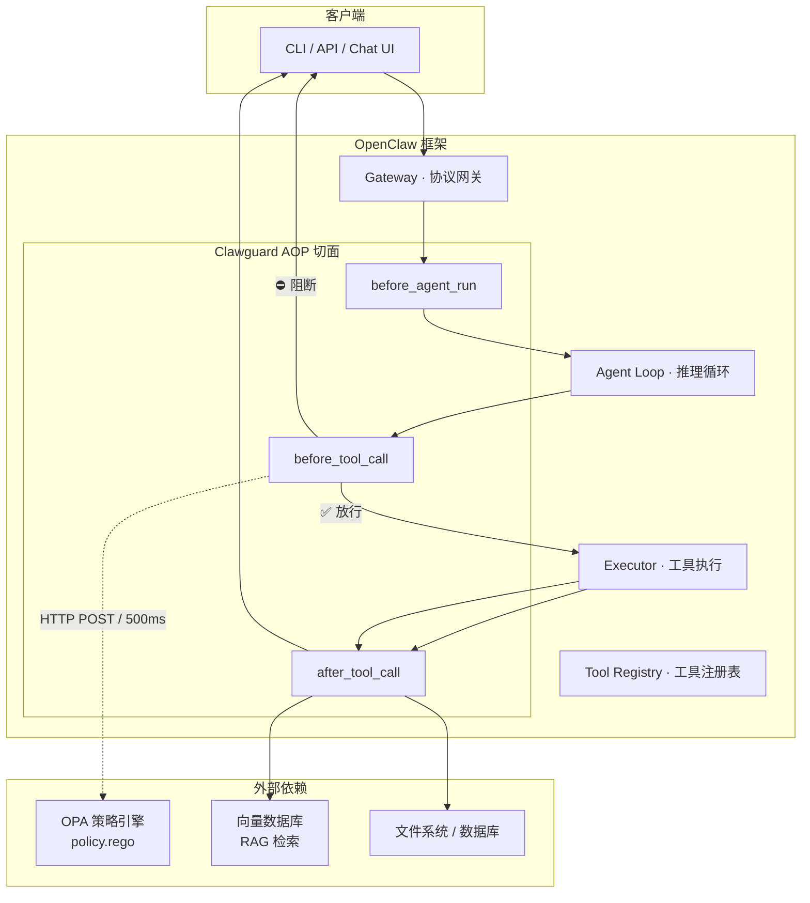
```mermaid
flowchart TB
    subgraph 用户侧["客户端"]
        CLI["CLI / API / Chat UI"]
    end

    subgraph OpenClaw["OpenClaw 框架"]
        direction TB
        GW["Gateway · 协议网关"]
        AL["Agent Loop · 推理循环"]
        TR["Tool Registry · 工具注册表"]

        subgraph 切面层["Clawguard AOP 切面"]
            BG["before_agent_run"]
            BT["before_tool_call"]
            AT["after_tool_call"]
        end

        EX["Executor · 工具执行"]
    end

    subgraph 外部系统["外部依赖"]
        OPA["OPA 策略引擎<br/>policy.rego"]
        VDB["向量数据库<br/>RAG 检索"]
        FS["文件系统 / 数据库"]
    end

    CLI --> GW --> BG --> AL
    AL --> BT -->|"✅ 放行"| EX
    BT -->|"⛔ 阻断"| CLI
    EX --> AT --> FS
    EX --> AT --> VDB
    AT --> CLI
    BT -.->|"HTTP POST / 500ms"| OPA
```

### 2.2 模块内部分层

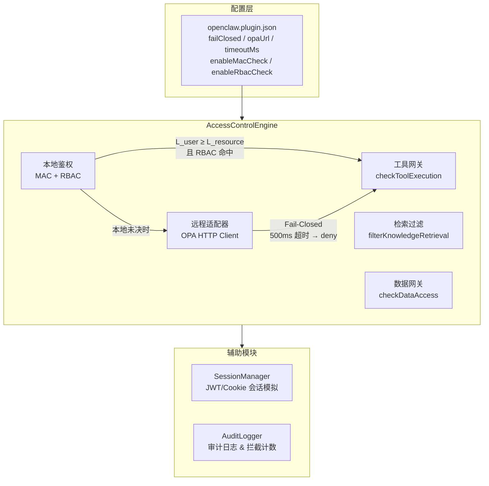
```mermaid
flowchart TD
    subgraph 配置层["配置层"]
        SCHEMA["openclaw.plugin.json<br/>failClosed / opaUrl / timeoutMs<br/>enableMacCheck / enableRbacCheck"]
    end

    subgraph 核心引擎["AccessControlEngine"]
        direction LR
        LOCAL["本地鉴权<br/>MAC + RBAC"]
        REMOTE["远程适配器<br/>OPA HTTP Client"]
        RAG["检索过滤<br/>filterKnowledgeRetrieval"]
        TOOL["工具网关<br/>checkToolExecution"]
        DATA["数据网关<br/>checkDataAccess"]
    end

    subgraph 辅助层["辅助模块"]
        SM["SessionManager<br/>JWT/Cookie 会话模拟"]
        AUDITOR["AuditLogger<br/>审计日志 & 拦截计数"]
    end

    SCHEMA --> 核心引擎
    核心引擎 --> 辅助层

    LOCAL -->|"L_user ≥ L_resource<br/>且 RBAC 命中"| TOOL
    LOCAL -->|"本地未决时"| REMOTE
    REMOTE -->|"Fail-Closed<br/>500ms 超时 → deny"| TOOL
```

### 2.3 Agent Loop 生命周期与切面映射

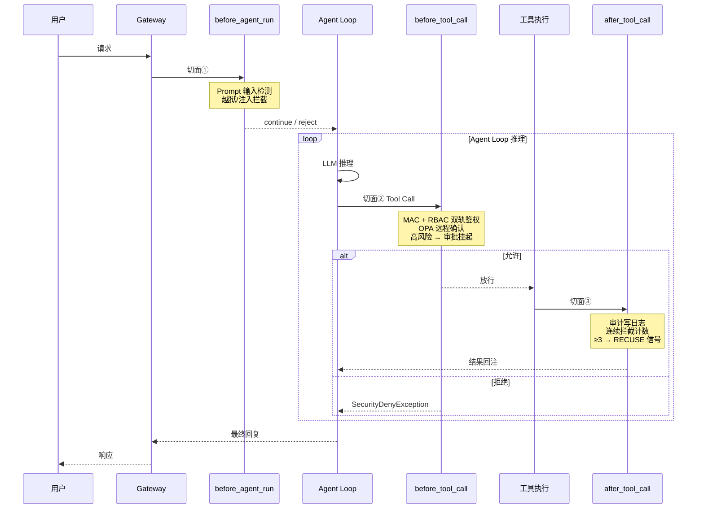
```mermaid
sequenceDiagram
    participant U as 用户
    participant GW as Gateway
    participant BG as before_agent_run
    participant AL as Agent Loop
    participant BT as before_tool_call
    participant TK as 工具执行
    participant AT as after_tool_call

    U->>GW: 请求
    GW->>BG: 切面①
    Note over BG: Prompt 输入检测<br/>越狱/注入拦截
    BG-->>AL: continue / reject

    loop Agent Loop 推理
        AL->>AL: LLM 推理
        AL->>BT: 切面② Tool Call
        Note over BT: MAC + RBAC 双轨鉴权<br/>OPA 远程确认<br/>高风险 → 审批挂起
        alt 允许
            BT-->>TK: 放行
            TK->>AT: 切面③
            Note over AT: 审计写日志<br/>连续拦截计数<br/>≥3 → RECUSE 信号
            AT-->>AL: 结果回注
        else 拒绝
            BT-->>AL: SecurityDenyException
        end
    end

    AL-->>GW: 最终回复
    GW-->>U: 响应
```

---

## 3. AOP 切面拦截机制

Clawguard 不修改 OpenClaw 源码，通过框架暴露的三个生命周期钩子实现无侵入挂载。

### 3.1 三个切面职责

| 切面 | 触发时机 | 主要职责 | 阻塞语义 |
|---|---|---|---|
| `before_agent_run` | 用户输入到达后、Agent 开始推理前 | Prompt Guard：检测注入/越狱模式 | 阻断后终止整个 Trace |
| `before_tool_call` | Agent 产出 tool_call 后、执行前 | MAC+RBAC 鉴权；OPA 确认；审批流判定 | 阻断后抛 SecurityDenyException |
| `after_tool_call` | 工具执行完成、结果返回 Agent 前 | 审计日志；连续拦截计数；Recuse 信号 | 非阻塞，仅记录/信号 |

### 3.2 before_tool_call 的决策树

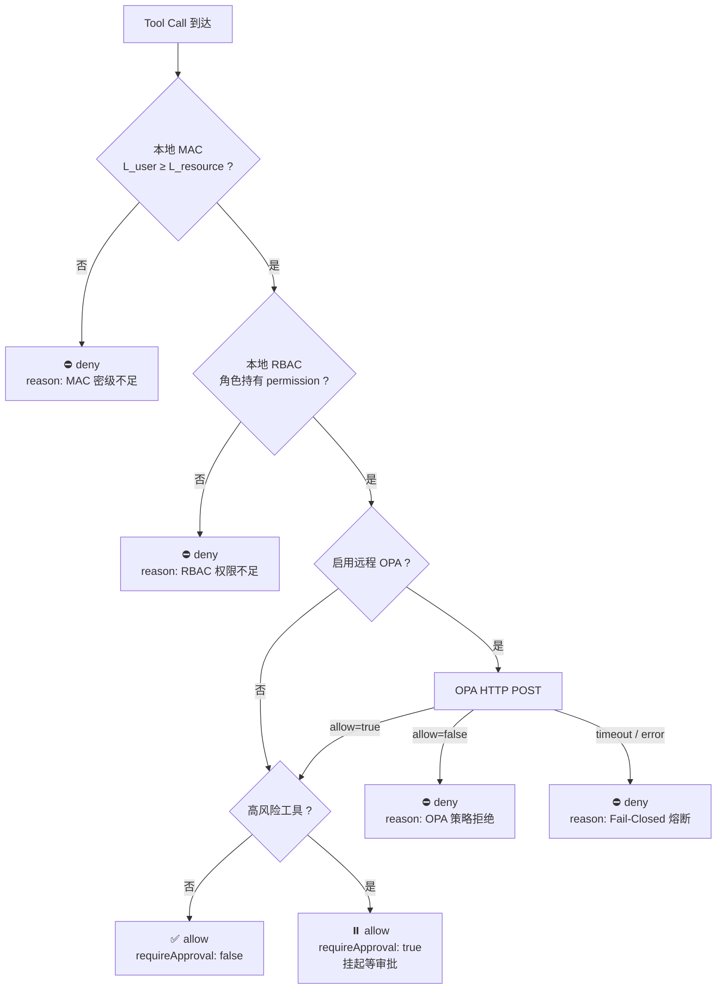
```mermaid
flowchart TD
    TC["Tool Call 到达"] --> L1{"本地 MAC<br/>L_user ≥ L_resource ?"}
    L1 -->|"否"| R1["⛔ deny<br/>reason: MAC 密级不足"]
    L1 -->|"是"| L2{"本地 RBAC<br/>角色持有 permission ?"}
    L2 -->|"否"| R2["⛔ deny<br/>reason: RBAC 权限不足"]
    L2 -->|"是"| L3{"启用远程 OPA ?"}
    L3 -->|"否"| L4{"高风险工具 ?"}
    L3 -->|"是"| OPA_CHECK["OPA HTTP POST"]
    OPA_CHECK -->|"allow=true"| L4
    OPA_CHECK -->|"allow=false"| R3["⛔ deny<br/>reason: OPA 策略拒绝"]
    OPA_CHECK -->|"timeout / error"| R4["⛔ deny<br/>reason: Fail-Closed 熔断"]
    L4 -->|"否"| PASS["✅ allow<br/>requireApproval: false"]
    L4 -->|"是"| APPROVAL["⏸️ allow<br/>requireApproval: true<br/>挂起等审批"]
```

---

## 4. 双轨鉴权引擎

### 4.1 MAC 轨（强制访问控制）

**唯一规则**：

$$L_{user} \ge L_{resource}$$

```
user.clearance_level  ≥  resource.required_level
```

密级为整数，取值 1(low) / 2(medium) / 3(high)。用户密级从会话上下文提取（由认证层注入），资源密级在工具/资源注册时静态声明。

**代码路径**：[access_controller.ts:L210](access_controller.ts#L210)

```typescript
if (user.clearance_level < resource.required_level) {
  return { allow: false, reason: "MAC 拦截" };
}
```

### 4.2 RBAC 轨（基于角色的访问控制）

**权限命名规范**：`{namespace}:{action}`

| 命名空间 | 示例 | 含义 |
|---|---|---|
| `agent` | `agent:run` | 启动 Agent |
| `tool` | `tool:read_file` | 调用 read_file 工具 |
| `data` | `data:user_db:read` | 读取用户数据库 |
| `knowledge` | `knowledge:internal_doc:search` | 检索内部文档 |
| `audit` | `audit:read` | 查看审计日志 |

**角色权限矩阵**：[access_controller.ts:L64-L94](access_controller.ts#L64-L94)

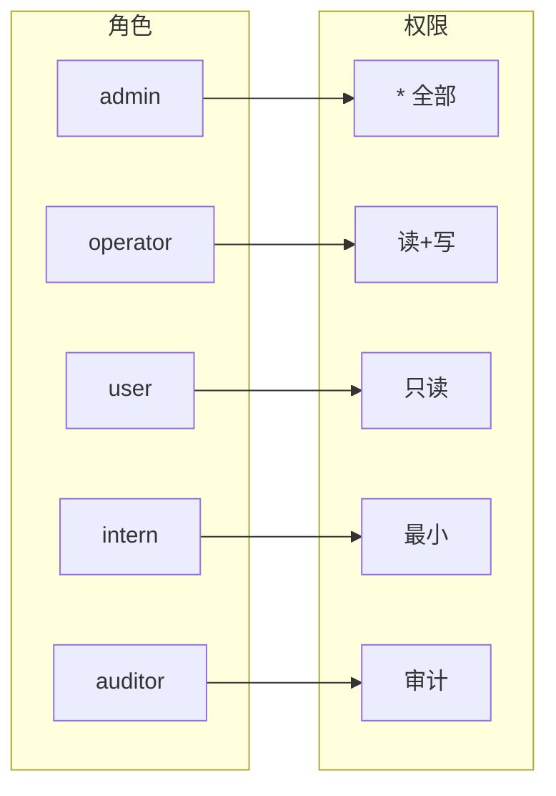
```mermaid
flowchart LR
    subgraph 角色
        ADMIN["admin"]
        OP["operator"]
        USR["user"]
        INT["intern"]
        AUD["auditor"]
    end

    subgraph 权限
        ALL["* 全部"]
        RW["读+写"]
        RO["只读"]
        MIN["最小"]
        LOG["审计"]
    end

    ADMIN --> ALL
    OP --> RW
    USR --> RO
    INT --> MIN
    AUD --> LOG
```

**权限匹配算法**：[access_controller.ts:L168-L188](access_controller.ts#L168-L188)

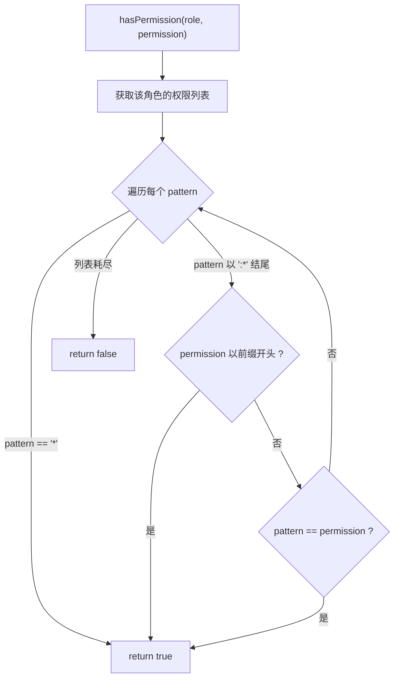
```mermaid
flowchart TD
    START["hasPermission(role, permission)"] --> PATTERNS["获取该角色的权限列表"]
    PATTERNS --> LOOP{"遍历每个 pattern"}
    LOOP -->|"pattern == '*'"| TRUE["return true"]
    LOOP -->|"pattern 以 ':*' 结尾"| PREFIX{"permission 以前缀开头 ?"}
    PREFIX -->|"是"| TRUE
    PREFIX -->|"否"| EXACT{"pattern == permission ?"}
    EXACT -->|"是"| TRUE
    EXACT -->|"否"| LOOP
    LOOP -->|"列表耗尽"| FALSE["return false"]
```

### 4.3 双轨合成策略

```
Decision = MAC_allow ∧ RBAC_allow

仅当两者均为 true 时放行。任一为 false 即阻断。

若通过基础鉴权且工具在高风险集合中:
  → allow = true, requireApproval = true
```

高风险工具集合：`{write_file, delete_file, execute_bash, modify_config}`

---

## 5. OPA 远程策略引擎

### 5.1 为什么需要远程 OPA

本地引擎覆盖了基本的 MAC + RBAC 逻辑，但存在局限：

1. **策略更新需重新部署**：本地规则编译进 JS bundle，修改角色权限表需要走 CI/CD
2. **无法做跨 Trace 的上下文决策**：比如"同一 IP 10 分钟内被拒绝 5 次则封禁"
3. **无法整合外部数据源**：如 LDAP 实时查询、威胁情报 Feed

OPA（Open Policy Agent）通过 **策略即代码（Policy as Code）** 解决这些问题。策略以 Rego 文件独立维护，OPA 服务热加载，修改策略无需触动业务代码。

### 5.2 Clawguard ↔ OPA 交互协议

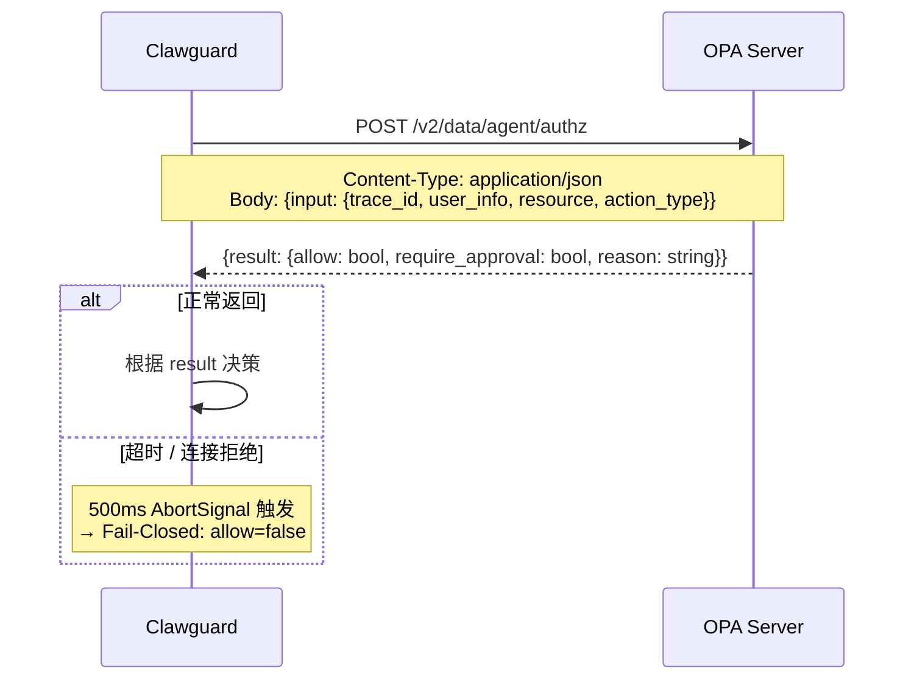
```mermaid
sequenceDiagram
    participant CW as Clawguard
    participant OPA as OPA Server

    CW->>OPA: POST /v2/data/agent/authz
    Note over CW,OPA: Content-Type: application/json<br/>Body: {input: {trace_id, user_info, resource, action_type}}
    OPA-->>CW: {result: {allow: bool, require_approval: bool, reason: string}}

    alt 正常返回
        CW->>CW: 根据 result 决策
    else 超时 / 连接拒绝
        Note over CW: 500ms AbortSignal 触发<br/>→ Fail-Closed: allow=false
    end
```

**请求体结构**：

```json
{
  "input": {
    "trace_id": "trace_abc123",
    "user_info": {
      "uid": "user_001",
      "role": "operator",
      "clearance_level": 2
    },
    "action_type": "tool",
    "resource": {
      "target": "write_file",
      "required_level": 2,
      "args": { "path": "/data/report.txt" }
    }
  }
}
```

### 5.3 Rego 策略规则解析

[policy.rego](policy.rego) 的逻辑分解：

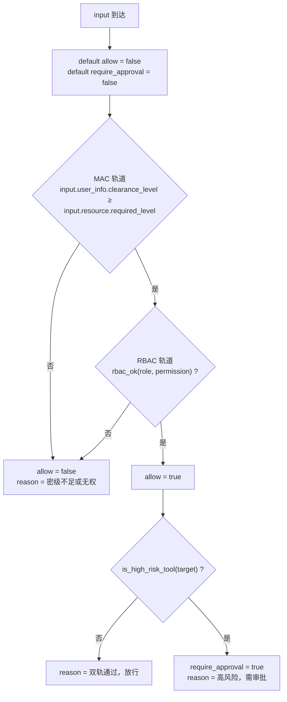
```mermaid
flowchart TD
    INPUT["input 到达"] --> DEFAULT["default allow = false<br/>default require_approval = false"]

    DEFAULT --> MAC{"MAC 轨道<br/>input.user_info.clearance_level ≥<br/>input.resource.required_level"}

    MAC -->|"否"| DENY["allow = false<br/>reason = 密级不足或无权"]

    MAC -->|"是"| RBAC{"RBAC 轨道<br/>rbac_ok(role, permission) ?"}

    RBAC -->|"否"| DENY

    RBAC -->|"是"| BASE["allow = true"]

    BASE --> RISK{"is_high_risk_tool(target) ?"}
    RISK -->|"否"| OK["reason = 双轨通过，放行"]
    RISK -->|"是"| APPROVAL["require_approval = true<br/>reason = 高风险，需审批"]
```

`rbac_ok` 辅助规则的分支匹配：

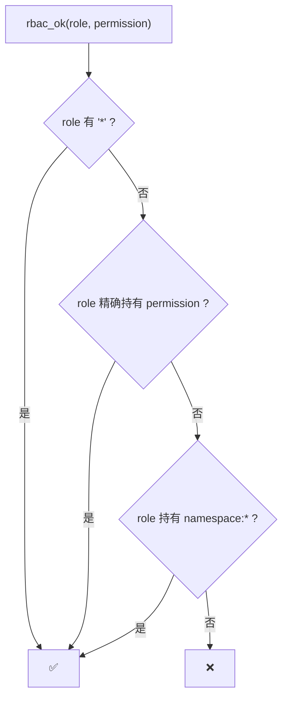
```mermaid
flowchart TD
    RULE["rbac_ok(role, permission)"] --> R1{"role 有 '*' ?"}
    R1 -->|"是"| PASS["✅"]
    R1 -->|"否"| R2{"role 精确持有 permission ?"}
    R2 -->|"是"| PASS
    R2 -->|"否"| R3{"role 持有 namespace:* ?"}
    R3 -->|"是"| PASS
    R3 -->|"否"| FAIL["❌"]
```

---

## 6. 三维访问控制模型

### 6.1 总览

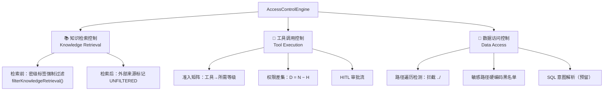
```mermaid
flowchart TD
    ENGINE["AccessControlEngine"] --> K["📚 知识检索控制<br/>Knowledge Retrieval"]
    ENGINE --> T["🔧 工具调用控制<br/>Tool Execution"]
    ENGINE --> D["💾 数据访问控制<br/>Data Access"]

    K --> K1["检索前：密级标签强制过滤<br/>filterKnowledgeRetrieval()"]
    K --> K2["检索后：外部来源标记 UNFILTERED"]

    T --> T1["准入矩阵：工具→所需等级"]
    T --> T2["权限差集：D = N − H"]
    T --> T3["HITL 审批流"]

    D --> D1["路径遍历检测：拦截 ../"]
    D --> D2["敏感路径硬编码黑名单"]
    D --> D3["SQL 意图解析（预留）"]
```

### 6.2 维度一：知识检索控制

**威胁模型**：低密级用户通过 Agent 的 RAG 能力间接检索高密级文档，突破向量数据库自身的权限隔离。

**防御策略**：在检索参数到达向量数据库之前，注入密级约束。

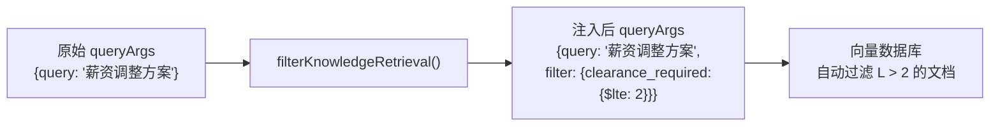
```mermaid
flowchart LR
    BEFORE["原始 queryArgs<br/>{query: '薪资调整方案'}"] --> FILTER["filterKnowledgeRetrieval()"]
    FILTER --> AFTER["注入后 queryArgs<br/>{query: '薪资调整方案',<br/> filter: {clearance_required: {$lte: 2}}}"]
    AFTER --> VDB["向量数据库<br/>自动过滤 L > 2 的文档"]
```

代码实现见 [access_controller.ts:L303-L320](access_controller.ts#L303-L320)。

### 6.3 维度二：工具调用控制

**威胁模型**：Agent 被诱导调用高敏感工具（如 execute_bash），以合法身份执行恶意操作。

**双重防线**：

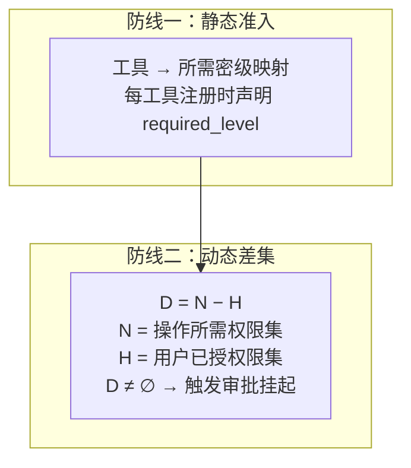
```mermaid
flowchart TD
    subgraph 防线1["防线一：静态准入"]
        MTX["工具 → 所需密级映射<br/>每工具注册时声明 required_level"]
    end

    subgraph 防线2["防线二：动态差集"]
        FORMULA["D = N − H<br/>N = 操作所需权限集<br/>H = 用户已授权限集<br/>D ≠ ∅ → 触发审批挂起"]
    end

    MTX --> FORMULA
```

**权限差集计算**：[access_controller.ts:L330-L355](access_controller.ts#L330-L355)

```
设: requiredPrivilege = "tool:write_file"
    userGrantedPrivileges = {"tool:read_file", "tool:web_search"}

则: requiredPrivilege ∉ userGrantedPrivileges
    → D ≠ ∅
    → allow=true, requireApproval=true
    → Trace 挂起，等待 HITL 审批
```

### 6.4 维度三：数据访问控制

**威胁模型**：
- 路径遍历：`../../etc/shadow`
- 敏感文件直接访问：`/etc/shadow`, `C:\Windows\System32\config\SAM`

**检测逻辑**：[access_controller.ts:L364-L393](access_controller.ts#L364-L393)

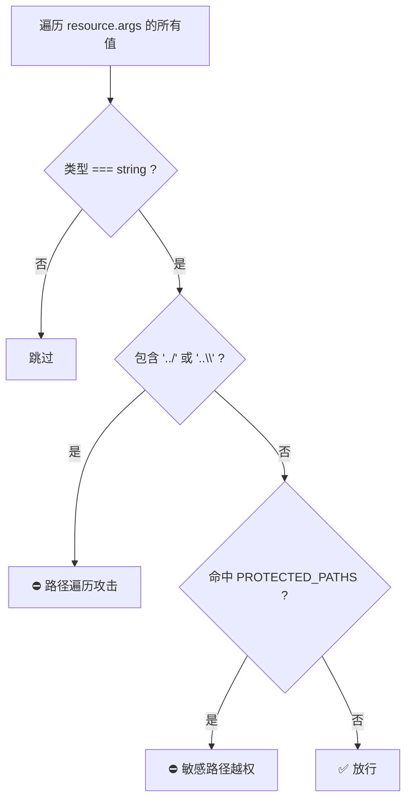
```mermaid
flowchart TD
    ARGS["遍历 resource.args 的所有值"] --> STR{"类型 === string ?"}
    STR -->|"否"| SKIP["跳过"]
    STR -->|"是"| TRAV{"包含 '../' 或 '..\\' ?"}
    TRAV -->|"是"| BLOCK1["⛔ 路径遍历攻击"]
    TRAV -->|"否"| SENS{"命中 PROTECTED_PATHS ?"}
    SENS -->|"是"| BLOCK2["⛔ 敏感路径越权"]
    SENS -->|"否"| PASS["✅ 放行"]
```

**黑名单**：

```typescript
const PROTECTED_PATHS = [
  "/etc/passwd",
  "/etc/shadow",
  "/etc/sudoers",
  "c:\\windows\\system32\\config\\sam",
  "/root/.ssh",
];
```

---

## 7. 动态审批与 Recuse 撤退

### 7.1 HITL 审批流

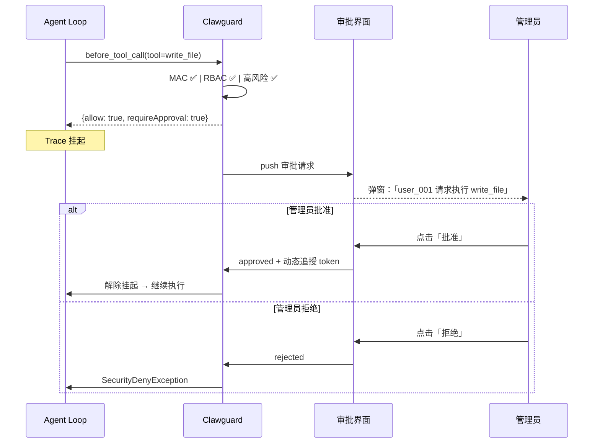
```mermaid
sequenceDiagram
    participant Agent as Agent Loop
    participant Guard as Clawguard
    participant UI as 审批界面
    participant Admin as 管理员

    Agent->>Guard: before_tool_call(tool=write_file)
    Guard->>Guard: MAC ✅ | RBAC ✅ | 高风险 ✅
    Guard-->>Agent: {allow: true, requireApproval: true}
    Note over Agent: Trace 挂起
    Guard->>UI: push 审批请求
    UI-->>Admin: 弹窗：「user_001 请求执行 write_file」

    alt 管理员批准
        Admin->>UI: 点击「批准」
        UI->>Guard: approved + 动态追授 token
        Guard->>Agent: 解除挂起 → 继续执行
    else 管理员拒绝
        Admin->>UI: 点击「拒绝」
        UI->>Guard: rejected
        Guard->>Agent: SecurityDenyException
    end
```

### 7.2 Recuse 撤退机制

当同一 Trace 内连续拦截次数 ≥ 3，Clawguard 通过带内信道注入 `RECUSE/0.1` 信号，通知合规 Agent 主动终止 Trace。

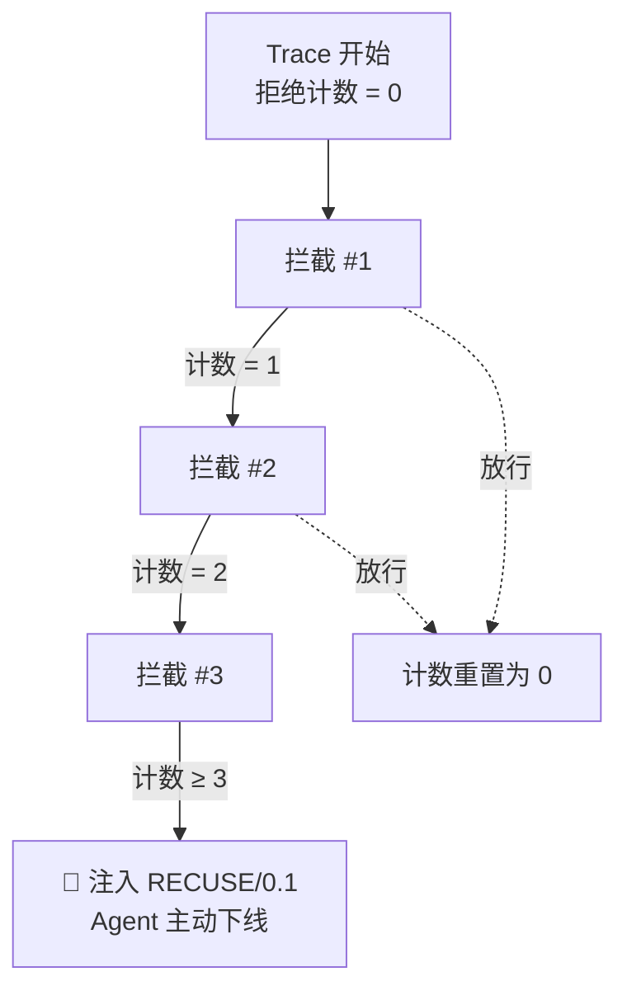
```mermaid
flowchart TD
    START["Trace 开始<br/>拒绝计数 = 0"] --> A1["拦截 #1"]
    A1 -->|"计数 = 1"| A2["拦截 #2"]
    A2 -->|"计数 = 2"| A3["拦截 #3"]
    A3 -->|"计数 ≥ 3"| RECUSE["🚨 注入 RECUSE/0.1<br/>Agent 主动下线"]
    A1 -.->|"放行"| RESET["计数重置为 0"]
    A2 -.->|"放行"| RESET
```

设计目的：防止攻击者通过不断变换参数试探安全边界（类似端口扫描的思路）。

---

## 8. 代码结构总览

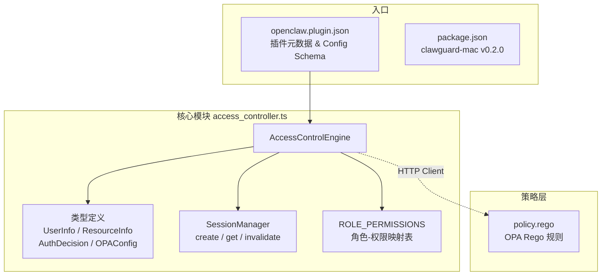
```mermaid
flowchart TD
    subgraph 入口["入口"]
        PLUGIN_JSON["openclaw.plugin.json<br/>插件元数据 & Config Schema"]
        PACKAGE_JSON["package.json<br/>clawguard-mac v0.2.0"]
    end

    subgraph 核心["核心模块 access_controller.ts"]
        TYPES["类型定义<br/>UserInfo / ResourceInfo<br/>AuthDecision / OPAConfig"]
        SM["SessionManager<br/>create / get / invalidate"]
        ACE["AccessControlEngine"]
        RP["ROLE_PERMISSIONS<br/>角色-权限映射表"]
    end

    subgraph 策略["策略层"]
        REGO["policy.rego<br/>OPA Rego 规则"]
    end

    PLUGIN_JSON --> ACE
    ACE --> TYPES
    ACE --> SM
    ACE --> RP
    ACE -.->|"HTTP Client"| REGO
```

### 8.1 AccessControlEngine 方法清单

| 方法 | 行号 | 职责 | 同步/异步 |
|---|---|---|---|
| `hasPermission(role, permission)` | L168-L188 | RBAC 权限匹配 | 同步 |
| `checkAuthorizationLocal(user, resource, actionType)` | L200-L242 | 本地 MAC+RBAC 双轨鉴权 | 同步 |
| `checkAuthorizationRemote(user, resource, traceId)` | L247-L293 | 远程 OPA 鉴权（500ms Fail-Closed） | 异步 |
| `filterKnowledgeRetrieval(user, queryArgs)` | L303-L320 | RAG 检索参数重构 | 同步 |
| `checkToolExecution(user, resource, grantedPrivileges)` | L330-L355 | 工具调用特权差集校验 | 同步 |
| `checkDataAccess(resource)` | L364-L393 | 路径遍历 & 敏感文件检测 | 同步 |

### 8.2 数据模型

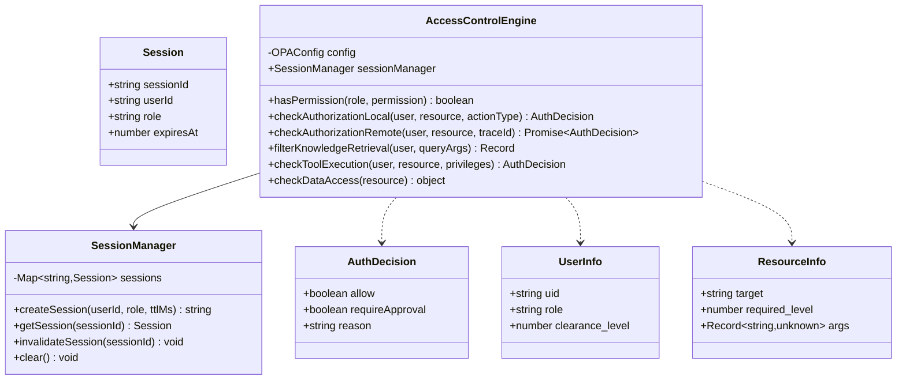
```mermaid
classDiagram
    class UserInfo {
        +string uid
        +string role
        +number clearance_level
    }

    class ResourceInfo {
        +string target
        +number required_level
        +Record~string,unknown~ args
    }

    class AuthDecision {
        +boolean allow
        +boolean requireApproval
        +string reason
    }

    class Session {
        +string sessionId
        +string userId
        +string role
        +number expiresAt
    }

    class SessionManager {
        -Map~string,Session~ sessions
        +createSession(userId, role, ttlMs) string
        +getSession(sessionId) Session
        +invalidateSession(sessionId) void
        +clear() void
    }

    class AccessControlEngine {
        -OPAConfig config
        +SessionManager sessionManager
        +hasPermission(role, permission) boolean
        +checkAuthorizationLocal(user, resource, actionType) AuthDecision
        +checkAuthorizationRemote(user, resource, traceId) Promise~AuthDecision~
        +filterKnowledgeRetrieval(user, queryArgs) Record
        +checkToolExecution(user, resource, privileges) AuthDecision
        +checkDataAccess(resource) object
    }

    AccessControlEngine --> SessionManager
    AccessControlEngine ..> AuthDecision
    AccessControlEngine ..> UserInfo
    AccessControlEngine ..> ResourceInfo
```

---

## 9. 研发计划

### 9.1 三阶段交付

| 阶段 | 周期 | 交付物 | 验证节点 |
|---|---|---|---|
| **一：AOP 插桩 + 本地鉴权** | 第 1–2 周 | 三切面挂载；MAC/RBAC 双轨引擎；OPA 适配器（500ms Fail-Closed）；SessionManager | TC-01 ~ TC-03 |
| **二：工具网关 + 审批流** | 第 3–4 周 | ToolGuard 工具检测；Shell 注入正则防御；HITL 审批交互接口 | TC-04 ~ TC-05, TC-09 |
| **三：路径安全 + Recuse** | 第 5–6 周 | 文件路径绝对化分析；敏感配置硬拦截；连续拒绝计数 + RECUSE/0.1 信号 | TC-06 ~ TC-08, TC-10 ~ TC-11 |

### 9.2 测试用例全量映射

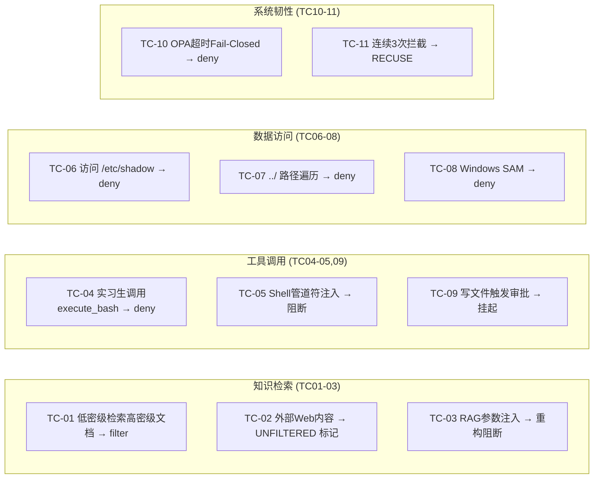
```mermaid
flowchart LR
    subgraph 维度一["知识检索 (TC01-03)"]
        TC01["TC-01 低密级检索高密级文档 → filter"]
        TC02["TC-02 外部Web内容 → UNFILTERED 标记"]
        TC03["TC-03 RAG参数注入 → 重构阻断"]
    end

    subgraph 维度二["工具调用 (TC04-05,09)"]
        TC04["TC-04 实习生调用execute_bash → deny"]
        TC05["TC-05 Shell管道符注入 → 阻断"]
        TC09["TC-09 写文件触发审批 → 挂起"]
    end

    subgraph 维度三["数据访问 (TC06-08)"]
        TC06["TC-06 访问 /etc/shadow → deny"]
        TC07["TC-07 ../ 路径遍历 → deny"]
        TC08["TC-08 Windows SAM → deny"]
    end

    subgraph 综合["系统韧性 (TC10-11)"]
        TC10["TC-10 OPA超时Fail-Closed → deny"]
        TC11["TC-11 连续3次拦截 → RECUSE"]
    end
```

---

## 附录 A：术语表

| 术语 | 展开 | 此处含义 |
|---|---|---|
| **AOP** | Aspect-Oriented Programming | 在 Agent Loop 生命周期钩子处挂载拦截逻辑，不修改框架源码 |
| **OPA** | Open Policy Agent | CNCF 毕业项目的策略决策引擎，通过 HTTP 提供鉴权决策服务 |
| **Rego** | — | OPA 的策略语言，声明式，基于 Datalog 扩展 |
| **Fail-Closed** | — | 安全系统故障时默认拒绝而非放行；本项目 OPA 超时/不可用即 deny |
| **HITL** | Human-in-the-Loop | 高风险操作挂起 Trace，等待管理员在线审批 |
| **Trace** | — | 一次 Agent 任务的完整执行链路 |
| **Recuse** | — | 连续被拦截 N 次后向 Agent 注入的主动下线信号 |

## 附录 B：推荐阅读顺序

1. [access_controller.ts](access_controller.ts) → `ROLE_PERMISSIONS`（L64-L94），理解角色模型
2. [access_controller.ts](access_controller.ts) → `checkAuthorizationLocal()`（L200-L242），理解双轨鉴权核心
3. [policy.rego](policy.rego) → `allow` 规则（L49-L62），对照 TS 版本理解 Rego 语法
4. [access_controller.ts](access_controller.ts) → `checkAuthorizationRemote()`（L247-L293），理解 Fail-Closed
5. [access_controller.ts](access_controller.ts) → `checkDataAccess()`（L364-L393），理解路径防御
