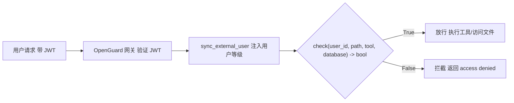
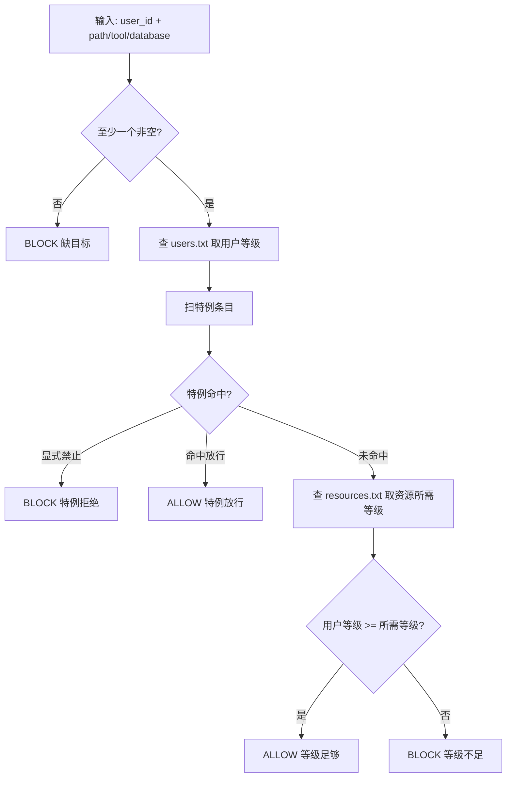

# Argus 访问控制网关

## 一、框架

### 整体架构



### 规则体系

两个纯文本文件，`|` 分割，`#` 注释，改了就生效：

| 文件                    | 格式                 | 示例                             |
| --------------------- | ------------------ | ------------------------------ |
| `rules/users.txt`     | `用户ID \| 等级 \| 特例` | `adminuser \| top_secret \| *` |
| `rules/resources.txt` | `资源模式 \| 所需等级`     | `C:\Windows\* \| top_secret`   |

等级映射：`public(1) < internal(2) < secret(3) < top_secret(4)`

零信任：`DEFAULT_RESOURCE_LEVEL = 99`，未列出的资源默认拒绝。

### 判定流程



### 代码文件

```
auth_gateway.py          # 核心模块（唯一对外接口）
rules/
  users.txt              # 用户规则
  resources.txt          # 资源规则
```

---

## 二、代码逻辑

### 核心函数 `check()`

```python
def check(user_id, path="", tool="", database="") -> bool:
    """返回 True=放行, False=拦截"""
    if not any([path, tool, database]):
        return False                          # 无目标 → block

    level = store.get_user_level(user_id)     # 1. 查用户等级
    special = _check_special(...)              # 2. 扫特例（优先）
    if special == "block": return False
    if special == "allow": return True

    required = _resource_required_level(...)   # 3. 查资源所需等级
    return level >= required                   # 4. 等级比对
```

### 资源匹配 `_match_pattern()`

三种匹配方式，自动选择：

```python
def _match_pattern(pattern, value):
    if "*" in pattern or "?" in pattern:
        return fnmatch(value, pattern)        # glob: C:\Windows\* → fnmatch
    if ":" in pattern:
        return value == pattern or ...         # 精确/前缀: tool:write_file
    return pattern in value                    # 子串兜底
```

### 外部用户注入 `sync_external_user()`

JWT 验证后把用户等级注入 `RuleStore`，与 `users.txt` 中的特例规则自动合并：

```python
def sync_external_user(user_id, security_level):
    """从 JWT / SQLite 同步用户等级，保留已有特例"""
    level = _normalize_level(security_level)
    store.set_user_level(user_id, level)
```

---

## 三、接入方式

### 基本调用

```python
from auth_gateway import check, sync_external_user

# JWT 验证后
user_id = payload["sub"]
security_level = payload.get("security_level", "public")
sync_external_user(user_id, security_level)

# 执行前拦截
if not check(user_id, path=target_path, tool=tool_name):
    return {"error": "access denied"}
```

---

## 四、测试

- top secret


- secret


- internal


- public


---

## 五、完善方案

1. **工具调用拦截**：当前聊天管道对用户**文字**做关键词猜测，应改为拦截 OpenClaw 返回的 `tool_call` 事件，对真实 `tool_name + target_path` 做 `check()`
2. **路径+工具组合约束**：path 和 tool 目前独立检查，无法表达"可读此目录但不能写"的交叉规则
3. **审计日志**：记录每次 `check()` 调用（用户、时间、资源、判定），用于追溯
