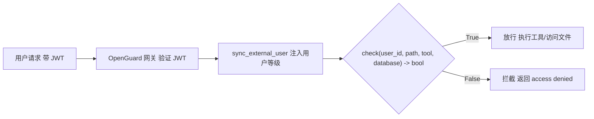
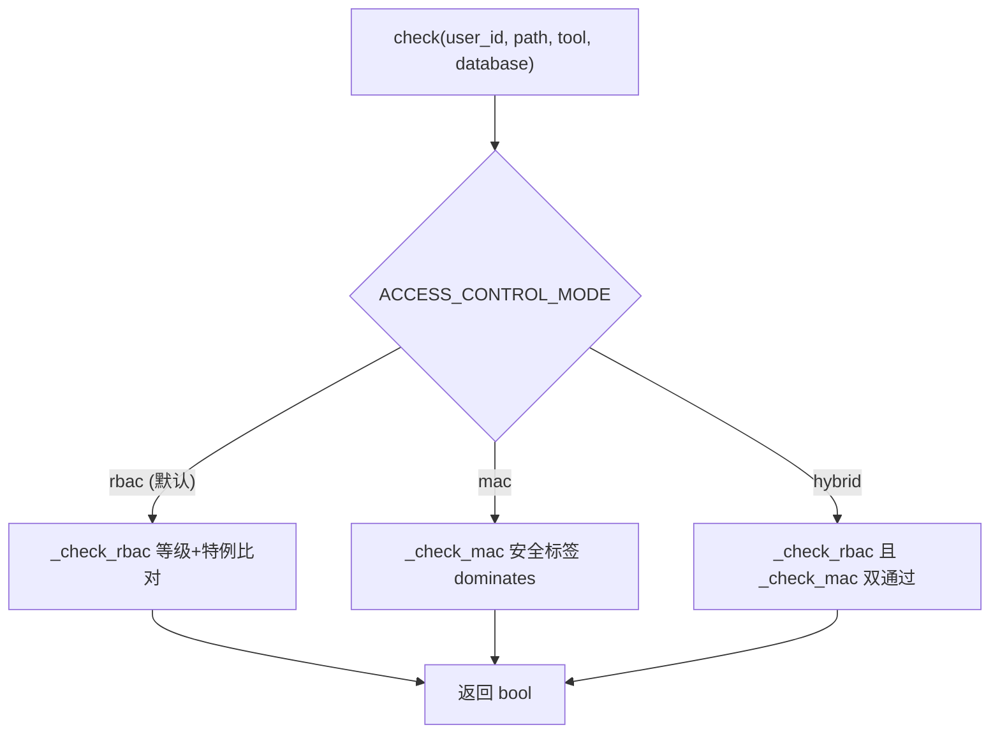
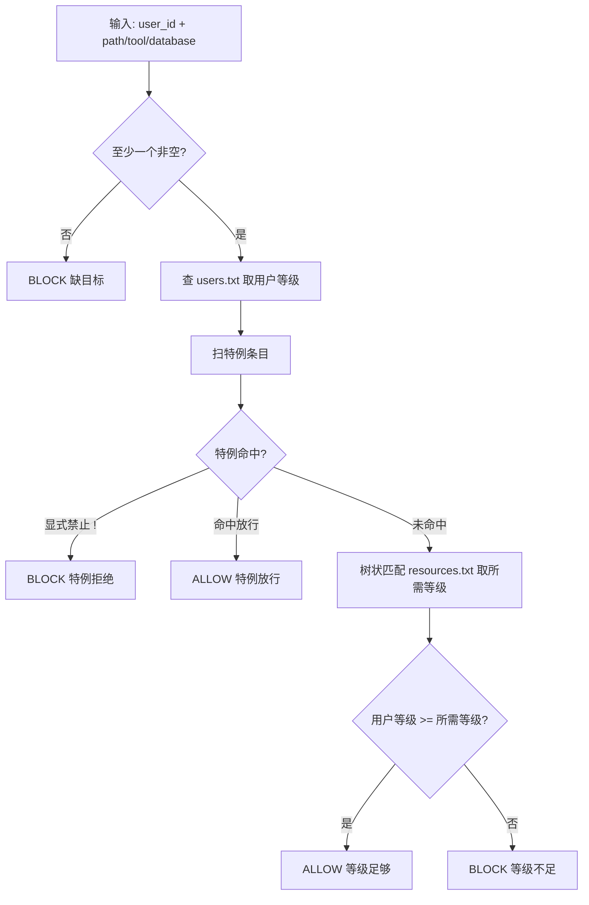

# Clawguard 访问控制网关 v3

## 一、框架

### 整体架构



v3 的核心入口仍是 `check()`，但在内部按 `CLAWGUARD_MODE` 环境变量分派到三种访问控制模型：



### 规则体系

规则仍外置于代码，`|` 分割、`#` 注释、改了就生效。与 v2 相比，资源规则文件新增**第三列继承模式**：

| 文件                    | 格式                     | 示例                                     |
| --------------------- | ---------------------- | -------------------------------------- |
| `rules/users.txt`     | `用户ID \| 等级 \| 特例`     | `adminuser \| top_secret \| *`         |
| `rules/resources.txt` | `资源模式 \| 所需等级 \| 继承模式` | `C:\Users\admin \| secret \| override` |

等级映射：`public(1) < internal(2) < secret(3) < top_secret(4)`，支持数字 / 字母 / 英文名三种写法。

零信任：`DEFAULT_RESOURCE_LEVEL = 99`，未列出的资源默认拒绝。

继承模式三种取值：

| 取值         | 含义                               |
| ---------- | -------------------------------- |
| `flat`     | 平铺，不参与树状继承，按 v2 逻辑直接比对           |
| `inherit`  | 继承：父目录规则被更深的子目录规则覆盖              |
| `override` | 覆盖：优先于同深度的 inherit 规则，用于"收紧"个别节点 |

规则文件支持行内注释：第三列之后写 `# 说明`（`#` 前需有空白），解析时自动剥离，不影响继承模式。

### 判定流程（RBAC 模式）



### 代码文件

```
auth_gateway.py          # 核心模块（唯一对外接口 + 规则管理 + CLI）
rules/
  users.txt              # 用户规则
  resources.txt          # 资源规则（含继承模式第三列）
  resources_win_linux.txt# 跨平台完整规则集（Windows + Linux，见《调研/规则完善方案.md》）
rules.db                 # 可选：SQLite 后端（存在时自动启用）
```

---

## 二、代码逻辑

### 核心函数 `check()`

```python
def check(user_id, path="", tool="", database="") -> bool:
    """返回 True=放行, False=拦截。按 CLAWGUARD_MODE 分派。"""
    if ACCESS_CONTROL_MODE == "rbac":
        return _check_rbac(user_id, path, tool, database)
    elif ACCESS_CONTROL_MODE == "mac":
        return _check_mac(user_id, path, tool, database)
    elif ACCESS_CONTROL_MODE == "hybrid":
        return _check_rbac(...) and _check_mac(...)
    else:
        return _check_rbac(...)
```

### RBAC 分支 `_check_rbac()`

v2 原有逻辑，但资源等级改用树状匹配：

```python
def _check_rbac(user_id, path="", tool="", database="") -> bool:
    if not any([path, tool, database]):
        return False                          # 1. 缺目标 → block
    level = _store.get_user_level(user_id)    # 2. 查用户等级（未知用户按策略处理）
    special = _check_special(...)             # 3. 扫特例（优先）
    if special == "block": return False
    if special == "allow": return True
    required = _resource_required_level_tree(...)   # 4. 树状匹配
    return level >= required                   # 5. 等级比对
```

### 树状资源匹配 `_resource_required_level_tree()`

v3 的核心改进。把路径看作一棵树，从叶子向根回溯，找到**最近且最优**的一条规则：

优先级规则：

1. **深度优先**：路径层级越深（越具体）优先级越高。`C:\Users\admin\secrets` 深度 2 > `C:\Users\admin` 深度 1
2. **override 优先**：同深度时 `override` 压过 `inherit`/`flat`
3. **更具体优先**：同深度同模式类型时，通配符更少、字符串更长的模式胜出，与规则文件顺序无关
4. **工具规则恒定占优**：`tool:`/`db:` 命名空间规则的深度 = `100 + 冒号数量`，保证工具规则永远高于路径规则

> Windows 盘符路径（如 `C:\...`）虽含冒号，但被 `_is_namespace_pattern()` 正确识别为路径、按真实层级计深度，不会误当成工具命名空间。

```python
def _resource_required_level_tree(path="", tool="", database="") -> int:
    best_level, best_depth, best_is_override, best_spec = 99, -1, False, (0, 0)
    for pattern, level, inherit_mode in _store.resources:
        for value in candidates:
            if not _match_pattern(pattern, value):
                continue
            if _is_namespace_pattern(pattern):        # tool:/db: 命名空间
                current_depth = 100 + pattern.count(":")
            else:                                      # 路径按真实层级（盘符 C:\ 不算命名空间）
                current_depth = pattern.count("\\") + pattern.count("/")
            is_override = inherit_mode == "override"
            spec = _pattern_specificity(pattern)       # 通配符更少、字符串更长者更具体
            better = (current_depth > best_depth
                      or (current_depth == best_depth and is_override and not best_is_override)
                      or (current_depth == best_depth and is_override == best_is_override and spec > best_spec))
            if better:
                best_level, best_depth = level, current_depth
                best_is_override, best_spec = is_override, spec
    return best_level
```

示例：`C:\Users\admin\secrets\pass.txt` 同时命中 `C:\Users\admin`(secret) 和 `C:\Users\admin\secrets`(top_secret)，取深度更深的 `top_secret`。

### MAC 安全标签

v3 引入强制访问控制（MAC），标签由系统分配、不可修改：

```python
@dataclass(frozen=True)
class SecurityLabel:
    level: int = 1                       # 1-4
    categories: frozenset = frozenset()  # 类别集合，compartment 隔离

    def dominates(self, other):
        # 简单安全规则：等级 >= 且 类别包含
        return self.level >= other.level and self.categories >= other.categories
```

`_check_mac()` 逐资源做 **simple security property（下读）**：`用户标签 dominates 资源标签` 才可读。写操作如需 *-属性规则（上写）可后续补充。

MAC 模式下用户/资源标签通过 `set_mac_label()` / `set_resource_mac_label()` 由系统管理员注入；未设置标签的用户自动降级为按 RBAC 等级构造标签。

### 规则管理接口

v3 把规则从"只读文件"升级为"可编程 CRUD"，全部经 `RuleStore` 线程安全地落到后端：

| 接口                                                            | 作用               |
| ------------------------------------------------------------- | ---------------- |
| `add_user_rule(uid, level, specials)`                         | 添加/更新用户规则        |
| `remove_user_rule(uid)`                                       | 删除用户规则           |
| `get_user_rule(uid)` / `list_user_rules(level, has_specials)` | 查询/列表            |
| `add_resource_rule(pattern, level, inherit_mode)`             | 添加资源规则           |
| `remove_resource_rule(pattern)`                               | 删除资源规则           |
| `list_resource_rules(min_level, max_level)`                   | 列表筛选             |
| `set_mac_label(uid, level, categories)`                       | 设置 MAC 标签（管理员专用） |

### 多后端存储

`_RuleBackend` 抽象基类统一了存取接口，两种实现自动选择：

| 后端               | 存储                                        | 启用方式                                    |
| ---------------- | ----------------------------------------- | --------------------------------------- |
| `_TextBackend`   | `rules/users.txt` + `rules/resources.txt` | 默认，兼容 v2                                |
| `_SQLiteBackend` | `rules.db`（两张表）                           | `rules.db` 存在时 `auto` 自动切换，或显式 `sqlite` |

CRUD 接口对后端无感知，同一套代码写文本文件或 SQLite。

### 外部用户注入 `sync_external_user()`

与 v2 相同，JWT 验证后注入等级，保留 `users.txt` 中已有的特例：

```python
def sync_external_user(user_id, security_level):
    level = _normalize_level(security_level)
    _store.set_user_level(user_id, level)
```

### 未知用户策略

`CLAWGUARD_BLOCK_UNKNOWN_USERS=true` 时，不在规则表中的用户一律拦截；默认 `false` 时按 `public(1)` 处理。

---

## 三、接入方式

### 基本调用

```python
from auth_gateway import check, sync_external_user

# JWT 验证后
user_id = payload["sub"]
security_level = payload.get("security_level", "public")
sync_external_user(user_id, security_level)

# 执行前拦截
if not check(user_id, path=target_path, tool=tool_name):
    return {"error": "access denied"}
```

### 模式切换

通过环境变量切换，无需改代码：

```bash
CLAWGUARD_MODE=rbac    # 基于角色（默认）
CLAWGUARD_MODE=mac     # 强制访问控制
CLAWGUARD_MODE=hybrid  # 双重校验
```

### 调试接口

`check_reason()` 返回 `(bool, 原因字符串)`，便于定位拦截原因，也可直接写入审计日志：

```python
ok, reason = check_reason("intern_01", "", "tool:write_file", "")
# (False, 'block: 用户等级 1 < 资源所需 3')
```

### CLI

```bash
python auth_gateway.py check user_01 /data/reports/q3.txt '' ''   # 判定
python auth_gateway.py demo                                       # 查看规则
python auth_gateway.py mode hybrid                                # 切换模式
python auth_gateway.py add-user new_user secret                   # 加用户
python auth_gateway.py remove-user new_user                       # 删用户
python auth_gateway.py add-resource 'C:\Temp\*' public inherit    # 加资源
python auth_gateway.py remove-resource 'C:\Temp\*'                # 删资源
python auth_gateway.py reload                                     # 热更新
```

---

## 四、测试

`test_auth_gateway.py` 共 14 组用例，覆盖：

- **等级转换**：数字/字母/英文名别名归一化
- **模式匹配**：glob 通配、工具前缀、路径边界、子串兜底
- **特例规则**：`!` 拒绝、`*` 全放、`!*` 全拒
- **RBAC 校验**：admin 全权限、等级不足拦截、特例越级放行
- **树状匹配**：`override` 深度优先（如 `C:\Users\admin\secrets` 需 4 级）
- **同深度优先级**：更具体模式优先，与文件顺序无关
- **跨平台路径规则**：Windows 盘符层级、Linux 具体文件、行内注释、路径边界
- **MAC 标签**：`dominates` 等级+类别判定、MAC 访问控制
- **MAC 与 RBAC 一致性**：MAC 分支树状解析资源标签，与 RBAC 结果一致
- **规则管理**：用户/资源规则增删改查
- **SQLite 后端**：双表读写往返
- **check_reason**：RBAC / MAC 两种模式下的原因输出
- **外部用户同步**：等级注入与更新

`verify_two_layers.py` 验证两层拦截：第一层浏览器→网关注入关键词预检，第二层 LLM 实际 `tool_call` 事件拦截，两组 5 场景全部通过。

### 手动测试

- secret


- internal


- public


---

## 五、完善方案

1. **MAC 读/写未区分**：`check()` 与 `_check_mac()` 无法区分读写操作，一律按"读"（BLP 下读）判定；写操作应走 *-属性规则（Biba 上写：用户完整性 ≤ 资源完整性），需要 check() 增加操作类型参数
2. **审计日志落库**：`check_reason()` 的判定结果目前只用于调试，应写入审计表（用户、时间、资源、判定、原因）
3. **规则管理 API 化**：CRUD 已就绪，下一步可挂 HTTP 端点 + Web 管理面板，配合 `reload_rules()` 热更新
4. **路径+工具组合约束**：path 与 tool 目前独立判定，无法表达"可读此目录但不能写"的交叉规则
5. **SQLite 与文本一致性**：两后端各有 `rules.db` / 文本文件两套事实来源，需明确主从关系或迁移工具
