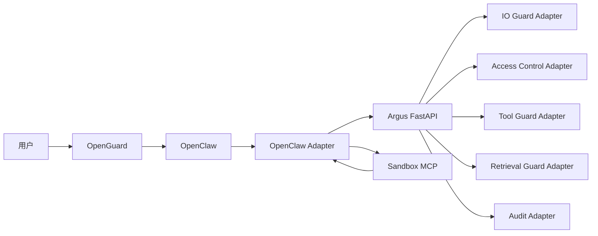

# Argus 各安全模块快速对接方案

> 适用范围：本方案只依据 `agenda` 目录中记录的模块现状制定。
>
> 项目定位：学生项目的第一版整合。首要目标不是把每个模块改造成完善的工程产品，而是尽量保留现有代码，用最少修改完成对接，让各模块能够在同一个整体项目中启动、被调用、返回结果并完成演示。

---

## 1. 对接目标

完成对接后，项目至少能够跑通下面这条链路：

```text
用户登录/输入
    ↓
输入安全检查
    ↓
OpenClaw 处理请求
    ↓
工具调用前：访问控制 + 工具安全检查
    ↓
工具执行（普通工具或沙箱 MCP）
    ↓
工具返回内容：检索安全检查 + 上下文安全检查
    ↓
OpenClaw 生成回复
    ↓
输出安全检查
    ↓
返回用户
    ↓
全流程写入审计日志
```

第一版的具体目标：

1. 每个原有安全模块尽量不改核心算法。
2. 每个模块外面增加一个很薄的“适配器”，负责转换输入和输出。
3. 使用一个统一 FastAPI 服务作为 Argus 总入口。
4. OpenClaw 侧的 Plugin 或源码修改只调用 Argus，不再各自直接维护安全判断逻辑。
5. 某个模块暂时出错时，能够在日志中看到错误，并根据配置选择跳过或拦截，方便联调。
6. 每个模块可以单独测试，也可以参加完整链路测试。
7. 团队成员通过一个 GitHub 仓库和独立分支完成合并。

---

## 2. `agenda` 中现有模块与对接位置

| 模块 | `agenda` 中已有形态 | 在整体项目中的位置 | 第一版对接方式 |
|---|---|---|---|
| OpenGuard | FastAPI、JWT、SQLite、Bridge、Web 页面 | 用户入口和身份来源 | 保持独立运行，将 `user_id`、`session_id` 传入 OpenClaw/Argus |
| 输入输出层 IO Guard | Python 检测流水线、模型、规则、输入/上下文/输出接口 | 输入、上下文、输出阶段 | 放入 `modules/io_guard/original`，由 `io_guard_adapter.py` 调用 |
| 访问控制 | `check(user_id, path, tool, database) -> bool` | 工具调用之前 | 通过函数进行调用 |
| 工具安全模块 | Trusted Tool Policy、工具风险判断、审批、SMCP 思路 | 工具调用之前 | OpenClaw Plugin 调 Argus `/v1/tool/pre_check` |
| 检索安全 SafeGuard | `/url/check`、`/guard`、`/wrap`，以及 agent-loop 修改 | web_search/web_fetch 结果进入上下文之前 | 第一版允许保留原 HTTP 服务，由统一适配器串联三个接口 |
| 沙箱 | Docker + MCP Server，提供执行和文件类工具 | 工具执行阶段 | 继续独立运行并注册为 MCP，不强行并入 FastAPI 主进程 |
| 审计层 | JSON/JSONL 事件、风险图、风险路径 | 所有阶段之后 | 统一服务每完成一个阶段就调用审计适配器 |
| 攻击数据集与评测 | JSONL 数据集、评测脚本和指标 | 整合完成后的验证 | 先选少量用例做冒烟测试，再运行完整数据集 |

这里的重点不是让所有模块变成同一种技术，而是让它们都能被统一调度：

```text
原模块可以是：Python 函数 / 本地 FastAPI / MCP Server
                         ↓
                  统一 Adapter
                         ↓
            Argus 统一接口
```

---

## 3. 总体对接思路

项目分成三个部分：

1. **OpenClaw 与 OpenGuard**：负责接收用户请求、运行 Agent、产生工具调用。
2. **Argus 主服务**：负责统一调用输入输出、访问控制、工具安全、检索安全和审计模块。
3. **沙箱 MCP**：保持独立，负责真正执行需要隔离的工具。


## 3.1 为什么只建立一个 Argus FastAPI

第一版不建议为每个模块单独设计新服务。原因是：

- 需要启动的进程太多，初学者很容易漏启动；
- 多个端口和依赖会增加排错难度；
- 每个人的接口本来就不同，再增加服务只会产生更多接口；
- 当前目标是对接，不是服务化改造。

因此采用：

- 能直接导入的 Python 模块：在 Argus 内通过函数调用；
- 已经做成 FastAPI、暂时不方便改的模块：适配器继续调用原 HTTP 接口；
- 沙箱：继续保持 MCP Server；
- OpenGuard：继续保持独立入口。

## 3.2 最重要的对接原则

### 原代码少改

每个成员提交原代码后，优先新增 `adapter.py`，不要直接大改原模块。

### 差异都放进 Adapter

例如访问控制原接口是：

```python
check(user_id, path="", tool="", database="") -> bool
```

统一系统不要求它立即改成复杂接口，而是由 Adapter 完成转换：

```text
统一 SecurityRequest
    ↓
提取 user_id、path、tool、database
    ↓
调用原 check()
    ↓
把 bool 转成统一 ModuleResult
```

---

## 4. 推荐项目结构

```text
argus/
├── README.md
├── requirements.txt
├── .env.example
├── .gitignore
│
├── argus/                         # 统一安全服务
│   ├── __init__.py
│   ├── api/
│   │   ├── __init__.py
│   │   └── main.py                    # FastAPI 入口
│   │
│   ├── common/
│   │   ├── __init__.py
│   │   ├── models.py                  # 公共数据结构
│   │   └── utils.py                   # ID、时间等简单工具
│   │
│   ├── core/
│   │   ├── __init__.py
│   │   └── registry.py                # 加载启用的 Adapter
│   │
│   ├── adapters/
│   │   ├── __init__.py
│   │   ├── base.py
│   │   ├── io_guard_adapter.py
│   │   ├── access_control_adapter.py
│   │   ├── tool_guard_adapter.py
│   │   ├── retrieval_guard_adapter.py
│   │   └── audit_adapter.py
│   │
│   └── modules/
│       ├── io_guard/
│       │   ├── original/              # 成员原代码
│       │   ├── README.md
│       │   └── requirements.txt
│       ├── access_control/
│       │   ├── original/
│       │   ├── rules/
│       │   └── README.md
│       ├── tool_guard/
│       │   ├── original/
│       │   └── README.md
│       ├── retrieval_guard/
│       │   ├── original/
│       │   ├── models/
│       │   └── README.md
│       └── audit/
│           ├── original/
│           └── README.md
│
├── openclaw_adapter/
│   ├── plugins/                       # 输入、工具前、输出 Plugin
│   ├── patches/                       # 当前检索层源码修改
│   ├── patch_source/                  # 修改后的目标文件或补丁说明
│   ├── config/                        # OpenClaw 配置示例
│   └── README.md
│
├── openguard/                         # 现有 OpenGuard，基本原样放入
│   ├── original/
│   └── README.md
│
├── sandbox_mcp/                       # 现有 Docker + MCP 项目
│   ├── original/
│   ├── README.md
│   └── config.example.json
│
├── configs/
│   ├── modules.yaml                   # 模块开关、运行方式、地址、错误策略
│   └── policy.yaml                    # 简单决策优先级和阈值
│
├── scripts/
│   ├── start_argus.ps1
│   ├── start_retrieval.ps1
│   ├── start_sandbox.ps1
│   ├── start_openguard.ps1
│   ├── start_all.ps1
│   ├── health_check.py
│   └── run_demo.py
│
├── tests/
│
│
├── evaluation/
│   ├── dataset/
│   ├── scripts/
│   └── reports/
│
└── runtime/                           # 不提交 GitHub
    ├── logs/
    ├── audit/
    └── temp/
```

---

## 5. 统一数据结构

第一版只统一三种主要结构：

1. `RequestContext`：这一请求是谁、属于哪个会话；
2. `SecurityRequest`：当前阶段和具体数据；
3. `ModuleResult` / `SecurityResponse`：模块结果和最终结果。

建议直接放入 `argus/common/models.py`。

## 5.1 RequestContext

```python
from pydantic import BaseModel, Field
from typing import Any, Dict, List, Literal, Optional


class RequestContext(BaseModel):
    trace_id: str
    session_id: str = "default_session"
    user_id: str = "default_user"
    stage: Literal["input", "tool_pre", "content", "output"]
    timestamp: str
```

字段说明：

| 字段 | 必填 | 说明 | 暂时没有时如何处理 |
|---|---|---|---|
| `trace_id` | 是 | 一次完整用户请求的链路 ID | 写1                |
| `session_id` | 是 | OpenClaw/OpenGuard 会话 ID | 写1 |
| `user_id` | 是 | OpenGuard 验证后的用户 ID | 写1 |
| `stage` | 是 | 当前处于哪个安全阶段 | 根据 API 路径填写 |
| `timestamp` | 是 | ISO 格式时间 | 自动生成 |

为了方便联调，OpenGuard 尚未接入时允许使用默认用户。OpenGuard 接入后，由 OpenGuard 或 OpenClaw Adapter 填写真实值。

## 5.2 SecurityRequest

```python
class SecurityRequest(BaseModel):
    context: RequestContext
    payload: Dict[str, Any] = Field(default_factory=dict)
```

不为每个阶段建立过多 Pydantic 类，第一版统一使用 `payload` 字典。每个阶段约定自己的字段即可。

## 5.3 ModuleResult

```python
class ModuleResult(BaseModel):
    module: str
    success: bool = True
    action: Literal["allow", "block", "rewrite", "human_review"] = "allow"
    risk_score: float = 0.0
    reason: str = ""
    modified_data: Optional[Any] = None
    details: Dict[str, Any] = Field(default_factory=dict)
    latency_ms: float = 0.0
    error: Optional[str] = None
```

说明：

- `success` 表示模块是否成功运行，不表示是否允许请求；
- `action` 表示模块建议的动作；
- `modified_data` 用于放置净化后的输入、包装后的网页内容或修改后的工具参数；
- `details` 保存模块独有信息，例如命中窗口、URL、规则名；
- 模块异常时使用 `success=false`，不要伪装成正常结果。

## 5.4 SecurityResponse

```python
class SecurityResponse(BaseModel):
    trace_id: str
    stage: str
    action: Literal["allow", "block", "rewrite", "human_review"]
    risk_score: float = 0.0
    reason: str = ""
    data: Optional[Any] = None
    module_results: List[ModuleResult] = Field(default_factory=list)
```

OpenClaw Adapter 只需要关心：

- `action`；
- `reason`；
- `data`。

`module_results` 主要用于调试和演示页面展示。

## 5.5 统一动作含义

| action | 含义 | OpenClaw 侧行为 |
|---|---|---|
| `allow` | 原样放行 | 继续原流程 |
| `rewrite` | 使用修改后的数据 | 用 `data` 替换原输入、参数、内容或输出 |
| `human_review` | 需要用户确认 | Plugin 有审批能力时发起确认；暂时没有时按配置转成 block |
| `block` | 阻止 | 中止当前阶段并返回 `reason` |

禁止出现新的同义词，例如：

```text
deny / denied / reject / forbidden / pass / safe
```

这些原模块返回值都应在 Adapter 中转换为四种统一动作。

---

## 6. Adapter 统一写法

## 6.1 基础接口

`argus/adapters/base.py`：

```python
from abc import ABC, abstractmethod
from argus.common.models import ModuleResult, SecurityRequest


class BaseAdapter(ABC):
    name: str

    @abstractmethod
    async def run(self, request: SecurityRequest) -> ModuleResult:
        pass
```

所有 Adapter 都必须遵循：

```text
读取统一请求
→ 转换为原模块需要的参数
→ 调用原模块
→ 转换为 ModuleResult
→ 捕获异常并返回 success=false
```

## 6.2 允许的三种接入方式

### 方式 A：直接导入 Python 函数

最简单，适用于 IO Guard、访问控制、审计等模块。

```python
from argus.modules.access_control.original.auth_gateway import check

allowed = check(user_id=user_id, path=path, tool=tool_name)
```

### 方式 B：调用现有 HTTP 服务

适用于已经跑通 `/url/check`、`/guard`、`/wrap` 的检索安全模块。

```python
async with httpx.AsyncClient() as client:
    response = await client.post(
        f"{base_url}/guard",
        json={"text": content, "url": url, "session_id": session_id},
        timeout=timeout,
    )
```

第一版允许保留这种方式，不要求立即把 PIGuard 代码移动到主进程。

### 方式 C：MCP

沙箱继续通过 OpenClaw MCP 配置调用，不经过普通 Adapter 执行命令。Argus 只负责在工具调用前返回是否允许以及是否需要转交沙箱。

## 6.3 Adapter 错误处理模板

```python
async def run(self, request: SecurityRequest) -> ModuleResult:
    started = time.perf_counter()
    try:
        raw_result = self.call_original_module(request)
        return self.convert_result(raw_result, started)
    except Exception as exc:
        return ModuleResult(
            module=self.name,
            success=False,
            action="allow",  # 或者block
            reason="module_error",
            error=str(exc),
            latency_ms=(time.perf_counter() - started) * 1000,
        )
```

不要让异常直接冲出 Adapter，否则一个模块报错会使整个 FastAPI 返回 500，其他模块也无法继续联调。

---

## 7. 各安全模块输入输出接口

以下规定的输入输出接口仅作为建议，可根据实际需求修改。但是输入输出接口需满足5.统一数据结构中的RequestContext, SecurityRequest, ModuleResult, SecurityResponse的要求

## 7.1 输入安全模块

### 统一输入

```json
{
  "context": {
    "trace_id": "trace-demo-001",
    "session_id": "session-001",
    "user_id": "user-001",
    "stage": "input",
    "timestamp": "2026-08-03T10:00:00+08:00"
  },
  "payload": {
    "text": "用户原始输入",
    "channel": "web",
    "history": []
  }
}
```

### Adapter 调用内容

`io_guard_adapter.py` 从 `payload` 读取：

```text
text
channel
history（原模块不需要时可忽略）
```

然后调用 IO Guard 已有的输入检查函数或已有 `/v1/check/input` 接口。

### 统一输出

安全：

```json
{
  "module": "io_guard.input",
  "success": true,
  "action": "allow",
  "risk_score": 0.08,
  "reason": "passed",
  "modified_data": null,
  "details": {}
}
```

需要净化：

```json
{
  "module": "io_guard.input",
  "success": true,
  "action": "rewrite",
  "risk_score": 0.65,
  "reason": "input_normalized",
  "modified_data": {"text": "净化后的输入"},
  "details": {"detector": "rule_and_classifier"}
}
```

阻止：

```json
{
  "module": "io_guard.input",
  "success": true,
  "action": "block",
  "risk_score": 0.95,
  "reason": "prompt_injection_detected"
}
```

## 7.2 访问控制模块

### 统一输入

```json
{
  "context": {
    "trace_id": "trace-demo-001",
    "session_id": "session-001",
    "user_id": "user-001",
    "stage": "tool_pre",
    "timestamp": "2026-08-03T10:00:02+08:00"
  },
  "payload": {
    "tool_name": "read_file",
    "tool_call_id": "call-001",
    "arguments": {
      "path": "C:/demo/public.txt"
    },
    "database": ""
  }
}
```

### Adapter 转换

```python
user_id = request.context.user_id
tool_name = request.payload.get("tool_name", "")
arguments = request.payload.get("arguments", {})
path = arguments.get("path", "")
database = request.payload.get("database", "")

allowed = check(
    user_id=user_id,
    path=path,
    tool=tool_name,
    database=database,
)
```

### Adapter 输出转换

```python
if allowed:
    action = "allow"
    score = 0.0
    reason = "access_allowed"
else:
    action = "block"
    score = 1.0
    reason = "access_denied"
```

第一版不要求修改原来的布尔接口。

## 7.3 工具安全模块

### 统一输入

与访问控制共用同一个 `tool_pre` 请求，额外可以使用：

```json
{
  "tool_name": "exec",
  "tool_call_id": "call-002",
  "arguments": {"command": "python demo.py"},
  "tool_type": "runtime",
  "description": "执行本地命令"
}
```

### Adapter 职责

根据原工具模块的结果映射：

| 原模块结果 | 统一 action |
|---|---|
| 低风险、允许 | `allow` |
| 改写工具参数 | `rewrite` |
| 需要审批 | `human_review` |
| 拒绝 | `block` |

如果模块返回修改后的参数：

```json
{
  "action": "rewrite",
  "modified_data": {
    "tool_name": "sandbox_exec",
    "arguments": {"command": "python demo.py"}
  }
}
```

OpenClaw Plugin 必须使用 `modified_data` 中的工具名和参数继续执行。

## 7.4 检索安全模块

检索模块保留现有 A/B/C 三步：

```text
A URL 检查
→ B PIGuard 内容检测
→ C 安全包装
```

### 统一输入

```json
{
  "context": {
    "trace_id": "trace-demo-001",
    "session_id": "session-001",
    "user_id": "user-001",
    "stage": "content",
    "timestamp": "2026-08-03T10:00:05+08:00"
  },
  "payload": {
    "tool_name": "web_fetch",
    "tool_call_id": "call-003",
    "url": "https://example.com/page",
    "content": "网页返回正文",
    "source": "web_fetch",
    "metadata": "Source: Web Content"
  }
}
```

### Adapter 串联顺序

```python
# 1. URL 检查
url_result = POST /url/check
if not url_result["trusted"]:
    return block

# 2. 内容注入检查
guard_result = POST /guard
if not guard_result["safe"]:
    return rewrite("[此内容存在安全风险，已被拦截]")

# 3. 内容包装
wrap_result = POST /wrap
return rewrite(wrap_result["text"])
```

### 统一输出

```json
{
  "module": "retrieval_guard",
  "success": true,
  "action": "rewrite",
  "risk_score": 0.03,
  "reason": "external_content_wrapped",
  "modified_data": {
    "content": "包装后的安全文本"
  },
  "details": {
    "url_trusted": true,
    "guard_score": 0.03
  }
}
```

### 与 IO Guard 上下文检查的顺序

如果 IO Guard 也提供上下文检查，则顺序固定为：

```text
Retrieval Guard 处理网页内容
    ↓
IO Guard Context 再检查一次处理后的内容
    ↓
结果进入 OpenClaw 上下文
```

如果时间不够，第一版可以先只接 Retrieval Guard，IO Guard Context 通过 `modules.yaml` 关闭，避免重复调试。

## 7.5 输出安全模块

### 统一输入

```json
{
  "context": {
    "trace_id": "trace-demo-001",
    "session_id": "session-001",
    "user_id": "user-001",
    "stage": "output",
    "timestamp": "2026-08-03T10:00:08+08:00"
  },
  "payload": {
    "text": "OpenClaw 准备发送给用户的回复",
    "channel": "web"
  }
}
```

### 统一输出

- 正常输出：`allow`；
- 能够脱敏：`rewrite`，并把脱敏文本放入 `modified_data.text`；
- 不应发送：`block`。

## 7.6 沙箱模块

沙箱不使用普通 `ModuleResult` 执行命令，保持 MCP 工具形式。

工具前阶段只决定：

```text
是否允许调用
是否需要审批
是否要把普通执行工具改成沙箱工具
```

沙箱执行请求沿用现有 MCP 参数，例如：

```json
{
  "tool": "exec",
  "arguments": {
    "command": "python demo.py",
    "timeout": 30
  }
}
```

沙箱执行结果统一转换为 OpenClaw 能理解的工具结果：

```json
{
  "success": true,
  "stdout": "程序输出",
  "stderr": "",
  "exit_code": 0,
  "duration_ms": 123
}
```

第一版只需保证：

- OpenClaw 能看到沙箱 MCP 工具；
- 工具模块能把需要执行的任务转到沙箱；
- 沙箱结果仍然进入 `content` 检查；
- 审计层能记录工具名、参数摘要和执行结果。

## 7.7 OpenGuard 身份模块

OpenGuard 保持现有登录、JWT、会话、WebSocket 和 Bridge 代码。

需要增加的对接内容只有：

```text
user_id
session_id
role 或 security_level（如果已有）
trace_id
```

推荐通过请求头传递：

```text
X-Argus-User-Id
X-Argus-Session-Id
X-Argus-Trace-Id
X-Argus-Role
```

OpenClaw Adapter 读取这些字段后组成 `RequestContext`。如果当前 Bridge 不方便增加全部字段，第一版至少传 `user_id` 和 `session_id`，`trace_id` 由 Adapter 生成。

## 7.8 审计模块

统一审计事件：

```python
class AuditEvent(BaseModel):
    event_id: str
    trace_id: str
    session_id: str
    user_id: str
    timestamp: str
    stage: str
    source_module: str
    action: str
    risk_score: float
    reason: str
    content: Dict[str, Any] = Field(default_factory=dict)
    metadata: Dict[str, Any] = Field(default_factory=dict)
```

每个 `ModuleResult` 返回后，生成一条 `AuditEvent`。成员的安全模块不需要自己了解其他模块。

第一版审计流程：

```text
得到 ModuleResult
    ↓
Audit Adapter 转换 AuditEvent
    ↓
调用原审计模块或写入统一 JSONL
    ↓
原审计模块读取事件并生成风险图
```

审计写入失败时只记录控制台错误，不中断主流程，避免联调时因为审计模块问题导致其他模块全部无法运行。

---

## 8. FastAPI 接口

统一服务默认运行：

```text
http://127.0.0.1:8000
```

## 8.1 健康检查

```http
GET /health
```

响应：

```json
{
  "status": "ok",
  "modules": {
    "io_guard": "ok",
    "access_control": "ok",
    "tool_guard": "ok",
    "retrieval_guard": "ok",
    "audit": "ok"
  }
}
```

某个模块不可用时，整体仍可返回 200，模块状态写为 `error`，方便成员快速看出谁没有启动。

## 8.2 输入检查

```http
POST /v1/input/check
```

调用：IO Guard Input。

## 8.3 工具调用前检查

```http
POST /v1/tool/pre_check
```

调用顺序：

```text
Access Control
    ↓ 允许
Tool Guard
    ↓
合并结果
```

如果访问控制已经 `block`，可以直接返回，不再调用工具模块。

## 8.4 外部内容检查

```http
POST /v1/content/check
```

调用顺序：

```text
Retrieval Guard A/B/C
    ↓
可选 IO Guard Context
    ↓
合并修改后的 content
```

## 8.5 输出检查

```http
POST /v1/output/check
```

调用：IO Guard Output。

## 8.6 手动写审计事件

```http
POST /v1/audit/event
```

主要供 OpenGuard、OpenClaw Adapter、沙箱写入登录、工具执行和系统异常事件。

---

## 9. 模块配置文件

`configs/modules.yaml` 示例：

```yaml
argus:
  host: 127.0.0.1
  port: 8000

modules:
  io_guard_input:
    enabled: true
    mode: import
    on_error: allow

  io_guard_context:
    enabled: false
    mode: import
    on_error: allow

  io_guard_output:
    enabled: true
    mode: import
    on_error: allow

  access_control:
    enabled: true
    mode: import
    on_error: block

  tool_guard:
    enabled: true
    mode: import
    on_error: block

  retrieval_guard:
    enabled: true
    mode: http
    on_error: allow

  audit:
    enabled: true
    mode: import
    on_error: ignore

sandbox:
  enabled: true
  mode: mcp
  url: http://127.0.0.1:9876

human_review:
  unsupported_action: block
```

`on_error` 只允许：

| 值 | 含义 |
|---|---|
| `allow` | 记录错误并跳过该模块 |
| `block` | 模块错误时阻止当前操作 |
| `ignore` | 只适用于审计等非决策模块 |

为了顺利联调，输入、内容和输出模块可先设为 `allow`；访问控制和工具执行模块可设为 `block`。演示前再根据团队需要调整。

---

## 10. OpenClaw 侧适配器

OpenClaw 侧不要把所有安全模块分别接一遍，只接四个统一接口：

```text
/v1/input/check
/v1/tool/pre_check
/v1/content/check
/v1/output/check
```

## 10.1 输入阶段

输入 Plugin 或入口代码：

```text
取得用户输入
→ 组装 RequestContext
→ POST /v1/input/check
→ allow：原样继续
→ rewrite：使用 response.data.text
→ block：返回 reason
```

如果当前 Plugin 只能阻止、不能重写，则：

- 输入重写放在 OpenGuard 入口；
- Plugin 只处理 allow/block；
- 第一版不要为了重写能力大改 OpenClaw。

## 10.2 工具调用前

Trusted Tool Policy 或工具调用 Hook：

```text
取得 tool_name + arguments + tool_call_id
→ POST /v1/tool/pre_check
→ allow：执行原工具
→ rewrite：执行修改后的工具或参数
→ human_review：使用现有审批能力；没有则阻止并提示
→ block：阻止工具调用
```

## 10.3 工具结果和检索内容

`agenda/0727/README(1).md` 中已有 agent-loop 修改，可以作为第一版对接方式继续使用。

需要做的改变是：

- 不再分别调用 `/url/check`、`/guard`、`/wrap`；
- 改为只调用 Argus 的 `/v1/content/check`；
- 原来的三个 SafeGuard 接口由 `retrieval_guard_adapter.py` 在 Argus 内部调用。

这样 OpenClaw 侧只有一个内容接口，将来检索模块内部变化时不需要再改 OpenClaw。

建议保存：

```text
openclaw_adapter/patches/agent-loop.patch
openclaw_adapter/patch_source/修改后的 agent-loop.js
openclaw_adapter/README.md
```

README 必须写清：

1. 修改的 OpenClaw 版本；
2. 修改的文件路径；
3. 修改位置如何搜索；
4. 如何备份原文件；
5. 如何覆盖或应用补丁；
6. 如何恢复原文件；
7. 如何用一条 web_fetch 请求验证。

第一版允许人工应用补丁，不强制开发自动补丁系统。

## 10.4 输出阶段

输出 Hook：

```text
取得待发送文本
→ POST /v1/output/check
→ allow：原样发送
→ rewrite：发送 response.data.text
→ block：发送固定提示，例如“回复因安全策略被拦截”
```

## 10.5 HTTP 客户端统一封装

所有 Plugin 共用一个 `argus_client.ts`，不要各写一套请求代码。

建议提供：

```typescript
checkInput(request)
checkToolPre(request)
checkContent(request)
checkOutput(request)
healthCheck()
```

客户端只负责：

- 设置 Argus 地址；
- 发送 JSON；
- 设置超时；
- 解析 `SecurityResponse`；
- 请求失败时按配置返回 allow 或 block。

---

## 11. 启动和运行方式

## 11.1 第一版需要启动的进程

| 顺序 | 进程 | 是否必须 | 说 |
|---|---|---|---|
| 1 | Sandbox MCP :9876 | 需要沙箱演示时必须 | Docker/WSL2 环境 |
| 2 | Argus FastAPI :8000 | 必须 | 统一安全入口 |
| 3 | OpenClaw | 必须 | Agent 主体 |
| 4 | OpenGuard :3000 + Bridge | 需要登录页面时启动 | 可在后期接入 |

## 11.2 `start_all.ps1` 的职责

脚本只做这些事：

1. 检查 Python、Node、Docker 是否存在；
2. 为每个服务启动独立终端或后台进程；
3. 等待端口可用；
4. 调用 `health_check.py`；
5. 输出哪些模块成功、哪些失败；
6. 不因为一个可选模块失败就立即关闭全部进程。

## 11.3 健康检查输出示例

```text
[OK] Argus API       http://127.0.0.1:8000/health
[OK] Sandbox MCP         http://127.0.0.1:9876
[OK] OpenClaw Gateway    http://127.0.0.1:18789
[--] OpenGuard           未启动，本次使用 default_user
```

---

## 12. GitHub 对接方案

## 12.1 是否使用 GitHub

建议使用 GitHub，并采用**一个仓库**。原因不是建设复杂工程流程，而是方便：

- 所有人拿到相同目录结构；
- 不需要通过压缩包反复传代码；
- 可以看到每个模块是谁合入的；
- 合并出错后容易退回上一个可运行版本；
- 整合负责人可以逐个模块检查。

## 12.2 分支安排

只保留一个长期分支：

```text
main：始终尽量保持可运行
```

每名成员创建自己的短期分支：

```text
module/io-guard
module/access-control
module/tool-guard
module/retrieval-guard
module/sandbox
module/audit
module/openguard
integration/openclaw-adapter
```

不要建立复杂的 `develop/release/hotfix` 分支体系。

## 12.3 每个模块的提交范围

模块负责人只提交：

```text
自己的 original/
自己的 Adapter
自己的 README
自己的 requirements.txt
自己的测试 fixture
公共目录/代码只可添加功能函数，不可修改或删除函数/数据结构；如若有必要需求，则需告知负责人。
```

## 12.4 合并顺序

建议按以下顺序向 `main` 提交 Pull Request：

1. 整合骨架与 mock；
2. IO Guard；
3. 访问控制；
4. 工具安全；
5. 检索安全；
6. 沙箱；
7. 审计；
8. OpenGuard；
9. OpenClaw 完整适配器；
10. 评测脚本和数据集。

每合并一个模块都运行一次现有测试，避免最后一起合并时无法判断错误来源。

## 12.5 Pull Request 模板

每个 PR 描述中填写：

```markdown
## 模块

模块名称：
负责人：

## 原模块运行方法

启动命令：
测试命令：
需要的模型/配置：

## 对接方式

- [ ] Python import
- [ ] HTTP
- [ ] MCP

## 统一接口

接入 stage：
Adapter 文件：
正常输入样例：
正常输出样例：
拦截输入样例：
拦截输出样例：

## 自测

- [ ] 原模块仍能单独运行
- [ ] Adapter 单元测试通过
- [ ] `/health` 能看到模块
- [ ] 完整项目启动后能触发该模块
- [ ] 模块异常时不会让 Argus 直接 500
```

## 12.6 不应提交的文件

```gitignore
.env
__pycache__/
.venv/
node_modules/
runtime/
*.log
*.db
models/
```

如果模型太大，只在 README 中写下载位置和应该放入的目录。不要让每名成员重复把同一个模型提交到仓库。

---

## 13. 团队分工

每个人都不需要理解所有模块内部算法，但必须理解：

```text
自己的统一输入是什么
自己的统一输出是什么
自己的 Adapter 如何调用原模块
出现异常时如何在日志中定位
```

每个人需要修改代码完成对接，并上传至相应的位置，包括：对应的modules，adapters，所需要的公共数据结构等

## 14. 注意事项

1. 模型路径统一写入配置或环境变量，如若不写入配置，则需使用相对路径
2. Python环境统一为Pyhton 3.11.9
3. OpenClaw版本优先使用2026.6.11版本
4. Github仓库地址为 https://github.com/WT-ever/Argus