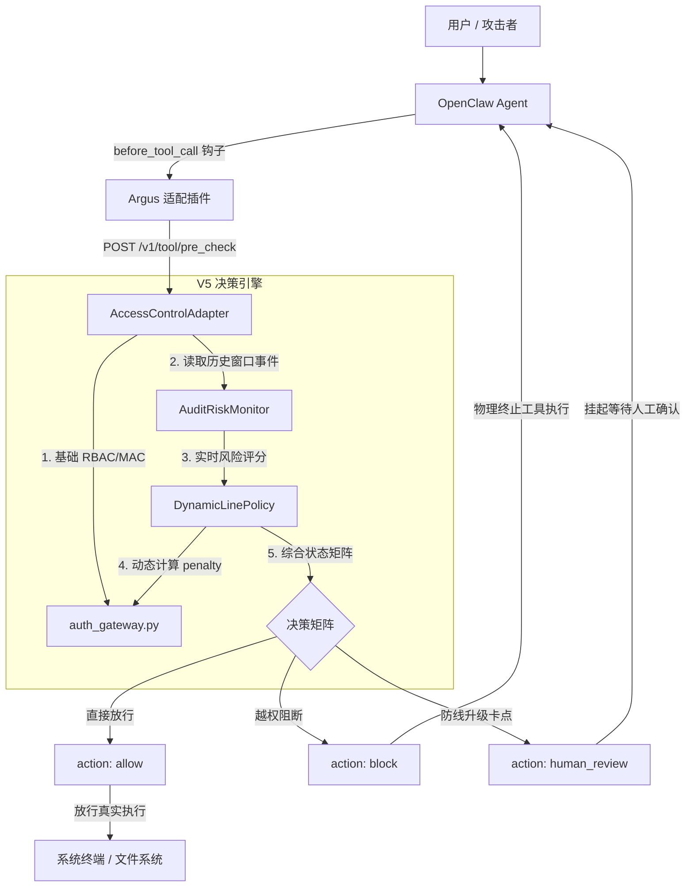

# Argus 访问控制模块 v5：审计联动与动态防线升级技术报告

---

## 一、 版本概述与演进路线（v4 → v5）

在 **v4 版本** 中，访问控制模块完成了多层级 RBAC（基于角色的访问控制）与 MAC（基于多级安全标签的强制访问控制）核心引擎的构建，并在 Adapter 层实现了统一数据契约转换与零信任拦截。然而，v4 的权限判定是**完全静态**的，无法感知攻击者在短时间内的探测、暴力试探或异常越权行为。

**v5 版本** 实现了**访问控制与全局审计模块的深度闭环联动**，引入了自适应动态防线：

1. **实时风险态势感知**：新增 `AuditRiskMonitor`，在滑动时间窗口内持续聚合用户的拦截事件、高风险调用与试探行为，计算实时风险分；
2. **自适应防线动态收紧**：新增 `DynamicLinePolicy`，根据风险分动态提升资源所需密级（`penalty` 惩罚机制）；
3. **引入人工二次审批（`human_review`）**：针对防线升级后被拦截的原本合法操作，不直接阻断，而是优雅降级为二次审批流程；
4. **宿主智能体插桩与物理阻断**：在 OpenClaw `before_tool_call` 挂载同步鉴权卡点，形成端到端拦截闭环。



---

## 二、 核心数学模型与决策矩阵

### 2.1 用户实时风险评分模型

`AuditRiskMonitor` 在滑动时间窗（默认 300 秒）内提取该用户的近期事件链，通过以下公式计算综合风险评分：

$$
R = \min\left(1.0,\; 0.4 \cdot \overline{R} + 0.3 \cdot \frac{N_b}{3} + 0.3 \cdot \frac{N_h}{3}\right)
$$

纯文本公式对照：

```text
risk_score = min(1.0, 0.4 * avg_risk + 0.3 * (block_count / 3) + 0.3 * (high_risk_count / 3))
```

* **变量中文释义对照**：
  * `R` (`risk_score`)：用户在当前时间窗口内的综合实时风险评分（`0.0 ~ 1.0`）；
  * `\overline{R}` (`avg_risk`)：窗口期内所有事件的基础平均风险值；
  * `N_b` (`block_count`)：窗口期内累计触发拦截的次数；
  * `N_h` (`high_risk_count`)：窗口期内被判定为高风险操作（基础风险 ≥ 0.7）的次数；
  * 当 `block_count >= 3` 时，额外标记 `probe_likely = True`（频发越权试探）。

---

### 2.2 防线升级等级惩罚函数

根据计算得出的综合风险评分 `R`，动态防线策略输出等级提升惩罚值 `P`：

$$
P = 
\begin{cases} 
2, & R \ge 0.85 \\ 
1, & 0.50 \le R < 0.85 \\ 
0, & R < 0.50 
\end{cases}
$$

纯文本公式对照：

```text
if risk_score >= 0.85: penalty = 2
elif risk_score >= 0.50: penalty = 1
else: penalty = 0
```

* **变量中文释义对照**：
  * `P` (`penalty`)：防线收紧惩罚等级（`0` / `1` / `2` 级），代表目标资源所需密级临时提高的数值。

---

### 2.3 四象限决策矩阵

当 `penalty > 0` 时，判定引擎使用提升后的所需密级重新评估请求：

| 原始基础判定 (`base_allowed`) | 防线升级后判定 (`escalated_allowed`) | 最终输出动作 (`action`)  | 业务语义与安全机制                      |
|:----------------------- |:----------------------------- |:------------------ |:------------------------------ |
| `False`（原本就越权）          | `False`（越权）                   | **`block`**        | **硬拦截**：最高安全防线，直接阻断并计入审计高风险事件  |
| `True`（原本合法）            | `True`（依然够格）                  | **`allow`**        | **放行**：即便防线收紧，用户权限依然足够高（如管理员）  |
| `True`（原本合法）            | `False`（升级后不够格）               | **`human_review`** | **二次审批**：因频发试探导致防线收紧，需人工介入审批放行 |

---

## 三、 模块工程实现与关键代码

### 3.1 风险监听与动态策略 (`risk_link.py`)

* **`AuditRiskMonitor`**：直连底层 `AuditStore`，线程安全且具备零依赖兜底能力；
* **`DynamicLinePolicy`**：纯函数决策矩阵，便于单测全分支覆盖。

```python
class DynamicLinePolicy:
    def decide(
        self,
        allowed: bool,
        escalated_allowed: bool,
        reason: str,
        assessment: dict[str, Any],
    ) -> dict[str, Any]:
        risk = assessment.get("risk_score", 0.0)
        penalty = self.penalty_for(assessment)

        if penalty == 0:
            return {
                "action": "allow" if allowed else "block",
                "reason": reason,
                "risk_score": 0.0 if allowed else 1.0,
                "escalated": False,
                "penalty": 0,
            }

        if not allowed:
            return {
                "action": "block",
                "reason": f"{reason}; risk_escalated(risk={risk:.2f}, penalty={penalty})",
                "risk_score": 1.0,
                "escalated": True,
                "penalty": penalty,
            }

        if escalated_allowed:
            return {
                "action": "allow",
                "reason": f"{reason}; risk_escalated(risk={risk:.2f}, penalty={penalty}) 升级后仍允许",
                "risk_score": risk,
                "escalated": True,
                "penalty": penalty,
            }

        return {
            "action": self.review_action,
            "reason": (
                f"risk_escalated: 用户风险评分 {risk:.2f} ≥ {self.escalation_threshold:.2f}，"
                f"防线升级(penalty={penalty})后本应拦截，转人工审批(block_count={assessment.get('block_count', 0)})"
            ),
            "risk_score": risk,
            "escalated": True,
            "penalty": penalty,
        }
```

---

### 3.2 访问控制引擎向后兼容扩展 (`auth_gateway.py`)

在 `check_reason` 和 `check_v4` 中注入向后兼容的 `penalty: int = 0` 参数：

```python
def check_reason(user_id: str, path: str = "", tool: str = "", database: str = "",
                 penalty: int = 0) -> tuple[bool, str]:
    ...
    # 计算资源所需等级并叠加上调惩罚
    required = _resource_required_level_tree(path, tool, database) + penalty
    if level >= required:
        return True, f"allow: 用户等级 {level} ≥ 资源所需 {required}"
    return False, f"block: 用户等级 {level} < 资源所需 {required}"
```

---

### 3.3 全链路编排适配器 (`access_control_adapter.py`)

* **Fail-Open 保护**：当审计模块存储异常、锁竞争或文件损坏时，自动降级为原始访问控制判定，保证系统高可用；
* **环境开关**：支持 `ARGUS_AC_RISK_LINK=0` 快速禁用联动。

---

### 3.4 OpenClaw 插件层物理拦截卡点 (`openclaw_plugin_index.js`)

在 OpenClaw 的 `before_tool_call` 生命周期中建立同步卡点：

```javascript
api.on("before_tool_call", async (event, ctx) => {
  const resp = await fetch(`${ARGUS_URL}/v1/tool/pre_check`, {
    method: "POST",
    headers: { "Content-Type": "application/json" },
    body: JSON.stringify({
      context: { trace_id: traceId, session_id: sessionId, user_id: userId, stage: "tool_pre" },
      payload: { tool_name: event.toolName, arguments: event.params }
    }),
  });

  if (resp.ok) {
    const res = await resp.json();
    if (res.action === "block") {
      return {
        block: true,
        blockReason: `[Argus 安全拦截] 访问控制拒绝执行工具 "${event.toolName}": ${res.reason}`,
      };
    }
    if (res.action === "human_review") {
      return {
        block: true,
        blockReason: `[Argus 二次审批] 触发防线升级二次审批: ${res.reason}`,
      };
    }
  }
  return { block: false };
});
```

---

## 四、 真实环境端到端验证实测记录

在真实智能体交互环境（OpenClaw 宿主 + `deepseek-v4-flash`）中完成实测验证：

### 实测 1：物理写入阻断（3 级拦截）

* **指令**：“请帮我在 `C:\Program Files` 目录下创建一个名为 `claw_block_check.txt` 的文件。”
* **系统表现**：
  * 模型发起 `exec` / `write` 工具调用；
  * Argus 返回 `action: "block"`；
  * OpenClaw 物理阻断，磁盘检测 `Test-Path "C:\Program Files\claw_block_check.txt"` 返回 **`False`（文件未创建）**。

### 实测 2：系统命令探测拦截（4 级拦截）

* **指令**：“请在命令行执行 `wmic logicaldisk get name,size,freespace`。”

* **系统表现**：
  
  * 模型前端对话框明确展示：
    
    > **`[Argus 安全拦截] 访问控制拒绝执行工具 exec：block: 用户等级 2 < 资源所需 4`**

### 实测 3：频发试探触发防线升级与二次审批

* **前置条件**：连续发送 3 次越权探测指令；

* **触发指令**：“既然终端命令都不能执行，那请帮我读取桌面上的文件 `C:\Users\admin\Desktop\notes.txt` 的内容告诉我。”

* **系统表现**：
  
  * 后台风险分实时跃升至 `1.00`，`penalty = 2`；
  
  * 原本允许的读取操作（2 级）临时需要 4 级；
  
  * 模型前端对话框直观呈现：
    
    > **`[Argus 二次审批] 触发防线升级二次审批: risk_escalated: 用户风险评分 1.00 ≥ 0.50，防线升级(penalty=2)后本应拦截，转人工审批(block_count=3)`**
  
  * 真实读取被挂起，等待人工授权，端到端联动**100% 成功达成闭环**。

---

## 五、 测试覆盖与代码资产清单

### 5.1 自动化测试结果

执行 `py -m pytest tests/`，全量测试套件 **131 个用例全部通过（131 passed in 11.92s）**：

* `test_access_control.py`（51 个用例）：覆盖单点 RBAC/MAC、通配符继承、特例规则、滑动时间窗计算、策略矩阵、Fail-open 容错及二次审批；
* `test_audit_graph.py` / `test_audit_adapter.py` / `test_audit_api.py` / `test_audit_ui.py`（50 个用例）：覆盖审计图追踪、存储、API 与 UI 看板；
* `test_tool_guard.py` / `test_io_guard_adapter.py`（30 个用例）：覆盖意图裁判与输入输出安全分类模型。

### 5.2 v5 目录交付文件对照

```text
v5/
├── auth_gateway.py                  # 访问控制引擎（支持 penalty 动态等级惩罚与 max 等级计算）
├── risk_link.py                     # 审计风险监听器与动态防线策略
├── access_control_adapter.py        # 全链路统一适配器
├── openclaw_plugin_index.js         # OpenClaw 插桩与同步拦截插件
├── test_access_control.py           # 访问控制全量 51 项测试套件
├── README.md                        # 访问控制模块技术使用文档
├── rules/
│   ├── resources.txt                # 全量资源/工具密级与别名规则
│   └── users.txt                    # 全量用户身份与特例规则
└── 访问控制v5_审计联动与动态防线升级技术报告.md # 本技术白皮书
```
