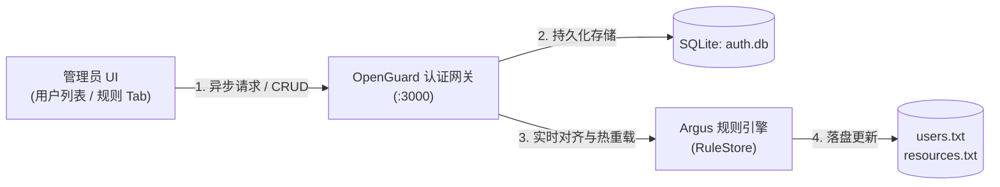
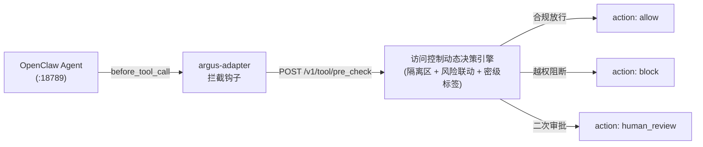
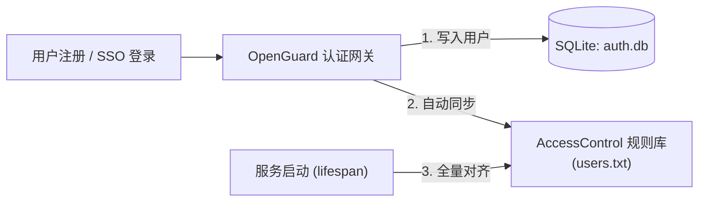

# Argus 访问控制模块 v7：OpenGuard 深度融合与管理后台实装技术周报

---

## 一、 版本概述与演进路线（v6 → v7）

在 **v6 版本** 中，访问控制模块完成了端到端四层服务物理链路（OpenGuard ↔ Bridge ↔ OpenClaw ↔ Argus）的首次完整跑通，通过 `argus-adapter` 实现了工具调用的卡点拦截，并验证了多密级阶梯测试与 5 分钟窗口下的动态防线升级机制。

**v7 版本** 是从“链路验证”迈向“工程闭环与管理赋能”的关键里程碑版本。本周核心完成了以下三大突破：

1. **OpenGuard V2.1 最新版本协同重构与接入**：
   OpenGuard 同学对网关进行了重大升级（引入多服务商 LLM 智能路由、按量计费折算、Skill 目录注册体系及防时序攻击等）。访问控制模块在此最新版底座上，完成了所有接入逻辑的全面重做与代码平滑融合，确保双方特性互不冲突、零代码回退。
2. **管理后台（Admin UI）访问控制深度实装**：
   * **多级安全权限管理**：在用户管理列表中新增“权限等级”动态编辑能力，管理员可实时变更用户密级（`top_secret`, `secret`, `internal`, `public`），数据库持久化与规则引擎秒级同步；
   * **规则修改专属 Tab**：在管理后台引入“规则修改”专属管理面板，配套全套 RESTful CRUD API，支持对 `users.txt` 与 `resources.txt` 进行在线可视化编辑、语法校验与免重启热重载。
3. **近永久隔离区（Quarantine Store & API）正式工程化落地**：
   将 v6 原型阶段的近永久隔离逻辑，全面升级为生产级代码实现（`quarantine_store.py` 与 `quarantine_routes.py`），提供多维度触发策略与管理员审计解封接口。

#### 图 1.1：管理控制面 —— OpenGuard 权限分配与规则热重载生命周期



#### 图 1.2：运行数据面 —— Agent 运行时零信任卡点鉴权与动态防御闭环



---

## 二、 管理后台访问控制三大核心能力实装

### 2.1 用户多级权限动态分配（Security Level Management）

为解决原本用户权限固定、管理员无法在系统运行时动态赋权的问题，本周在数据持久层与展现层完成了端到端改造：

1. **数据库层改造**：
   * 在 SQLite 数据表 `users` 中扩展 `security_level` 字段，默认值为 `public`；
   * 在 `database.py` 中封装 `update_user_security_level(user_id, security_level)` 专用原子更新函数；
   * 针对 Windows 环境下并发写入锁争用，优化了 SQLite 连接参数，增加 `timeout=30.0` 及 `PRAGMA busy_timeout = 30000`。
2. **API 接口暴露**：
   * 在 `routes.py` 中新增 `PUT /api/admin/users/{user_id}/security_level` 接口；
   * 采用 `SecurityLevelUpdateRequest` Pydantic 模型进行入参校验，严格限制只允许输入四个标准密级（`top_secret`, `secret`, `internal`, `public`）；
   * 在成功更新 SQLite 之后，自动触发 Access Control 规则引擎同步，更新内存映射并写入 `users.txt`。
3. **管理前端交互实装**：
   * 在 `admin.html` 的“用户管理”表格中，新增“权限等级”列；
   * 每一行渲染为原生下拉选择框（`<select class="role-select">`），带有直观的四级色彩徽章标识；
   * 绑定 `change` 事件监听，管理员切换等级后自动发起异步 PUT 请求，即选即生效，并伴有全局 Toast 反馈。

---

### 2.2 在线规则管理与热重载专属 Tab（Rules Management Tab）

针对以往“修改权限规则必须手动登录服务器编辑文本文件并重启进程”的运维痛点，在管理后台实装了专用的“规则修改”交互面板：

1. **前端管理面板**：
   * 在管理后台顶部导航栏与侧边栏接入“规则修改”独立 Tab；
   * 支持一键切换浏览与编辑 **用户规则 (`users.txt`)** 与 **资源规则 (`resources.txt`)**；
   * 内置等宽字体代码编辑区域与快速格式辅助提示，展示标准语法规范（如 `用户ID | 密级 | 特殊规则`）；
   * 提供“重新加载规则”、“保存并热重载”按钮，配备非法格式拦截校验。
2. **后台 RESTful API 契约**：
   * `GET /api/admin/rules`：同时获取当前生效的全部用户与资源规则内容；
   * `PUT /api/admin/rules/users`：提交并全量保存用户规则文本；
   * `PUT /api/admin/rules/resources`：提交并全量保存资源规则文本；
   * `POST /api/admin/rules/reload`：从磁盘强行重新解析并刷新内存中的 `RuleStore` 缓存。
3. **热重载机制保障**：
   调用保存后，规则引擎立即在当前进程内完成语法树的重构，运行中的智能体工具鉴权在下一次请求到达时即刻按新规则判定，**实现业务零中断热更新**。

---

### 2.3 双端身份自同步体系（Zero-touch User Sync）

为了确保 OpenGuard 平台中的用户体系与 Argus 访问控制模块的身份库保持 100% 强一致，构建了自动联动机制：



* **SPA 路由兜底保护（404 JSON Fix）**：
  排查并修复了 OpenGuard 历史前端因 `catchall_proxy` 将未匹配 API 粗暴转为 HTML 导致前端报错 `Unexpected token '<'` 的漏洞；为所有 `/api/admin/*` 添加显式保护，拦截未知路径并规范返回标准 JSON 404 响应。

---

## 三、 近永久隔离区（Quarantine）生产级工程化实装

在 v6 报告中确立了基于行为与历史画像的“5 分钟动态滑动惩罚 + 近永久隔离”双层防线理论模型。本周正式完成了该能力的完整代码落位与 API 闭环。

### 3.1 隔离触发判定模型

系统结合时间滑动窗口、频发试探标记与历史阻断频次，建立三因子联合触发判据：

$$
Q = (N_{b,5m} \ge 8) \lor (P_{likely} \land R \ge 0.85) \lor (N_{b,1h} \ge 15)
$$

纯文本公式对照：

```text
quarantine_triggered = (block_count_5m >= 8) or (probe_likely and risk_score >= 0.85) or (block_count_1h >= 15)
```

* **变量中文释义对照**：
  * `Q` (`quarantine_triggered`)：布尔判定量，若为真则立即触发进入近永久隔离区；
  * `N_{b,5m}` (`block_count_5m`)：当前 5 分钟滑动窗口内累计被拦截的次数（默认阈值为 8）；
  * `P_{likely}` (`probe_likely`)：由审计联动模块标记的“高置信度越权探测”布尔状态；
  * `R` (`risk_score`)：当前用户的实时综合风险分（范围 `0.0 ~ 1.0`）；
  * `N_{b,1h}` (`block_count_1h`)：当前 1 小时长窗口内累计被拦截的次数（默认阈值为 15，覆盖低频慢速探测攻击）。

---

### 3.2 隔离执行语义与工程实现

1. **持久化存储模块 (`quarantine_store.py`)**：
   * 采用线程安全读写锁与 JSON 状态文件结合的设计，隔离状态在服务重启后依然完好保持；
   * 记录隔离元数据：入隔离时间戳、触发原因（如 `frequent_probe` / `high_risk_threshold`）、触发时的风险评分与阻断历史快照。
2. **鉴权管线语义升级**：
   * **未被隔离用户**：依照常规基础 RBAC/MAC 及 5 分钟窗口内惩罚分 `penalty` 执行动态判定；
   * **已处于隔离状态用户**：
     * 若该操作在提升前属于越权操作（原本为 `block`），维持 **`block`**（硬性阻断）；
     * 若该操作在提升前属于正常操作（原本为 `allow`），强制收紧为 **`human_review`**（挂起并提交人工审核，剥夺其无人值守调用敏感工具的权利）。
3. **管理与解封接口 (`quarantine_routes.py`)**：
   * `GET /v1/quarantine/status/{user_id}`：实时查询指定用户是否处于隔离状态；
   * `POST /v1/quarantine/clear`：管理员专用解封接口，支持填写审核工单号并一键恢复用户正常状态。

---

## 四、 真实链路实机测试 Bug 剖析与修复

在本周四层全链路（OpenGuard ↔ Bridge ↔ OpenClaw ↔ Argus）联调与实机渗透测试中，排查并修复了以下三个关键 Bug：

### 4.1 Bug 1：大模型切换工具致拦截密级跳变（3 级 → 4 级）

* **现象**：用户请求读取 `.gitconfig`，首轮被拦截提示需 3 级，次轮再问却提示需 4 级。
* **根因**：两次鉴权目标不同。首轮 AI 调用只读工具 `read_file` 访问文件（需 3 级 secret）；拦截后 AI 自主改用系统命令行工具 `execute_bash` 执行 `type` 命令，触发了高危 Shell 工具鉴权（需 4 级 top_secret）。
* **处理**：优化拦截返回语义，明确区分文件级与工具级阻断，保持高危 Shell 的 4 级强管控。

### 4.2 Bug 2：WebSocket 链路漏传身份致密级降为 1 级

* **现象**：`user_01` 在后台已设为 2 级（internal），但实机对话鉴权时始终显示为 1 级。
* **根因**：OpenGuard WebSocket 转发向 OpenClaw 发送消息时漏传了 `senderId`，导致安全插件触发 fallback 将用户识别为 `default_user`，进而被零信任最小特权规则兜底赋予默认 1 级（public）。
* **修复**：在 WebSocket 消息参数中补全 `senderId` 与 `userId` 透传，并在插件与规则库中增加关联 Agent 身份兜底，成功恢复 2 级鉴权。

### 4.3 Bug 3：“规则修改”面板调整用户等级未生效缺陷

* **现象**：“用户管理”修改等级可生效，但在“规则修改”修改并保存用户规则后，全局鉴权与用户列表均无变化。
* **根因**：规则修改接口仅单向写盘 `users.txt`，未同步更新 SQLite 数据库；未联动同步同用户的 `user_id` 与 `username` 映射；且 Argus 引擎为独立进程，未监听文件变更，内存规则未刷新。
* **修复**：在规则接口中实现与 SQLite 及多身份标识的双向联动同步；在规则引擎中增加基于 `mtime` 的毫秒级自动热重载，实现免重启生效。
