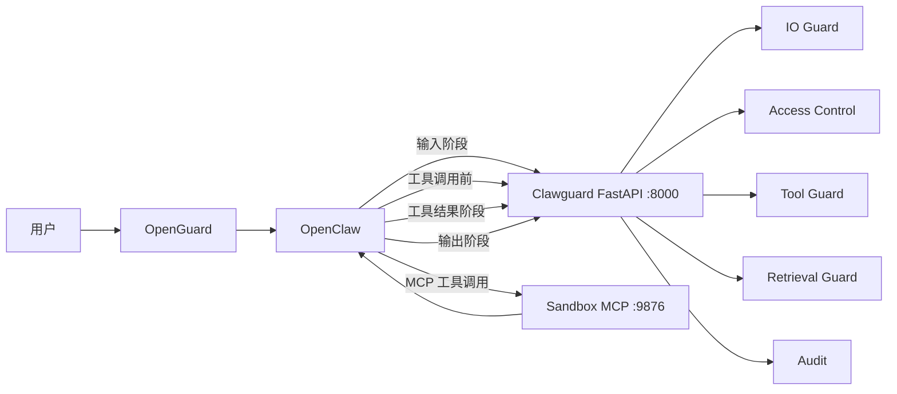
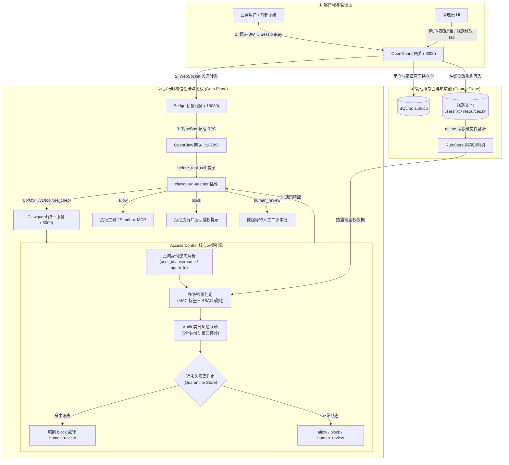

# Clawguard V2.1

## 项目简介

Clawguard 是一个面向智能体应用的全链路安全防护学生项目。目前项目以 OpenClaw 为首个接入对象，在尽量少修改 OpenClaw 和各成员原有安全模块的前提下，将输入输出防护、访问控制、工具安全、检索安全、沙箱执行和审计能力接入同一条运行链路。

本仓库是 Clawguard V2.1 的统一对接仓库。当前版本已经建立公共数据结构、统一 FastAPI 接口、模块注册表和基础配置，并接入 IO Guard、Access Control、Tool Guard、Retrieval Guard、Audit、OpenGuard 与 Sandbox 的真实实现。

## 1. 功能列表

| 功能 | 对应模块 | 接入阶段 | 当前仓库状态 |
|---|---|---|---|
| 用户身份与会话 | OpenGuard | 用户进入 OpenClaw 前 | 原模块已接入 |
| 输入安全检查 | IO Guard Input | OpenClaw 处理用户输入前 | 原模块和真实 Adapter 已接入 |
| 访问控制 | Access Control | 工具执行前 | 原模块和真实 Adapter 已接入 |
| 工具安全检查 | Tool Guard | 工具执行前 | 原模块和真实 Adapter 已接入 |
| 检索内容安全 | Retrieval Guard | web_search、web_fetch 等结果进入上下文前 | 原模块和真实 Adapter 已接入 |
| 上下文安全检查 | IO Guard Context | 工具结果进入模型上下文前 | 原模块和真实 Adapter 已接入 |
| 沙箱执行 | Sandbox MCP | 工具执行阶段 | 独立 MCP 实现已接入 |
| 输出安全检查 | IO Guard Output | 回复发送给用户前 | 原模块和真实 Adapter 已接入 |
| 日志与风险审计 | Audit | 全链路 | 原模块、接口和管理页已接入 |
| 攻击数据集评测 | Evaluation | 对接完成后 | 预留数据、脚本和报告目录 |

当前统一 API 提供以下接口：

| 方法 | 路径 | 作用 |
|---|---|---|
| `GET` | `/health` | 查看 Clawguard 和各 Adapter 的状态 |
| `POST` | `/v1/input/check` | 输入安全检查 |
| `POST` | `/v1/tool/pre_check` | 访问控制和工具安全检查 |
| `POST` | `/v1/content/check` | 检索内容和可选上下文检查 |
| `POST` | `/v1/output/check` | 输出安全检查 |
| `POST` | `/v1/audit/event` | 写入统一审计事件 |

### IO Guard 0.2

IO Guard 当前覆盖输入、外部内容和输出三个阶段，只返回 `allow`、`rewrite`、`block`。其检测目标收敛为四类风险来源和五类输出失败模式，并支持对 PDF、DOCX、XLSX、CSV、文本和常见图片附件做文本抽取/OCR 后复用输入检测管线。

`/v1/content/check` 按“Retrieval Guard 净化 → IO Guard Context 复检”的顺序执行；Retrieval Guard 阻断时不会继续调用后续模块。详细安装、附件协议、配置和测试方法见 [`clawguard/modules/io_guard/README.md`](clawguard/modules/io_guard/README.md)。

### Access Control 访问控制（动态自适应防线、近永久隔离与管理后台深度实装）

访问控制模块（Access Control）是智能体执行安全的第一道核心卡点防线，负责在**工具调用前（`tool_pre`）**对当前操作主体、调用工具、目标文件路径或数据库进行严格的零信任鉴权。本模块特色架构包括：

1. **多租户三向身份强对齐**：OpenGuard 业务层 `user_id`、登录名 `username` 与 OpenClaw 专属智能体 `agent_id` 深度对齐，支持多用户工作区物理隔离与身份兜底解析；
2. **多模型强制访问控制（MAC + RBAC）**：建立 `public` (1级)、`internal` (2级)、`secret` (3级)、`top_secret` (4级) 四级安全阶梯，支持通配符、继承模式（`flat`/`inherit`/`override`）与独立用户特例黑白名单；
3. **自适应动态防线提级（Dynamic Defense Escalation）**：联动 Audit 模块在 5 分钟滑动窗口内实时计算综合风险分与阻断频次，触发动态等级惩罚（`penalty`），将升级后不合规的操作优雅降级为 `human_review`（二次人工审批）；
4. **近永久隔离区（Quarantine Store & API）**：针对低频慢速探测攻击设立跨窗口联合判据，违规用户入隔离区后剥夺高权限工具自主调用权；
5. **管理后台可视化热重载**：全面实装 OpenGuard Admin UI“规则修改”与“用户管理”面板，支持对 `users.txt` 与 `resources.txt` 进行在线编辑、语法校验、SQLite 原子持久化与毫秒级免重启热重载。

详细架构设计与测试用例见后文 [2.3 访问控制特色架构](#23-访问控制access-control特色架构) 及 [`clawguard/modules/access_control/README.md`](clawguard/modules/access_control/README.md)。

## 2. 系统架构

Clawguard V2.1 使用一个统一 FastAPI 服务向 OpenClaw 提供安全接口。OpenClaw 运行到相应阶段时调用对应接口，FastAPI 路由再通过 Adapter 调用仓库内部的安全模块。

Retrieval Guard 与 IO Guard、Access Control、Tool Guard、Audit 一样，共用 Clawguard FastAPI，不再单独启动 Retrieval Guard FastAPI 服务，也不需要额外的 `base_url` 或 `timeout_seconds` 配置。

沙箱由于采用 MCP 协议并需要独立运行环境，继续作为单独的 Sandbox MCP 服务接入 OpenClaw。



### 2.1 调用流程

```text
用户输入
  ↓
OpenClaw 输入 Hook
  ↓ POST /v1/input/check
IO Guard Input
  ↓
OpenClaw 产生工具调用
  ↓ POST /v1/tool/pre_check
Access Control → Tool Guard
  ↓
普通工具或 Sandbox MCP 执行
  ↓ POST /v1/content/check
Retrieval Guard → 可选 IO Guard Context
  ↓
OpenClaw 生成回复
  ↓ POST /v1/output/check
IO Guard Output
  ↓
返回用户并写入审计事件
```

### 2.2 Adapter 的作用

各成员原有模块的函数名、参数和返回值可能不同。Adapter 负责：

1. 接收统一 `SecurityRequest`；
2. 提取原模块需要的参数；
3. 调用成员的原模块；
4. 把原模块结果转换成统一 `ModuleResult`；
5. 捕获异常，避免单个模块使整个 FastAPI 直接返回 500。

模块差异应尽量在 Adapter 中解决，不应修改公共请求和响应结构来适配单个模块。

### 2.3 访问控制（Access Control）特色架构

访问控制模块在系统中承担“运行数据面卡点拦截”与“管理控制面动态赋权”的双重视角闭环职责：



#### 2.3.1 多租户三向身份对齐机制（Triple Identity Alignment）

智能体生态下存在多套异构标识体系。访问控制层构建了贯穿网关与引擎的三向对齐映射：
* **业务主体 ID (`user_id`)**：OpenGuard 用户唯一标识（如 `usr_aJllMSlvWgkz4AQi`）；
* **用户登录名 (`username`)**：用户可视账号名（如 `user_01`）；
* **专属智能体 ID (`agent_id`)**：OpenClaw 隔离工作区专属标识（如 `agent_gbkxkbgikcmonklp`）。

在网关层，所有会话通过规范的 `sessionKey: "agent:<agentId>:<key>"` 进行租户隔离；适配器在截获工具调用时支持逆向提取，并在引擎内部通过 SQLite `auth.db` 动态回查兜底，保证多租户物理隔离与零信任最小特权（Default Level 1）原则，彻底解决身份悬空问题。

#### 2.3.2 四级强制访问控制与资源继承矩阵（MAC + RBAC）

系统将所有工具、敏感路径和数据源划分为四级安全密级：

| 密级数值 | 英文代号 | 密级中文名 | 典型受控工具与资源操作 | 典型路径与资源示例 |
| :---: | :--- | :--- | :--- | :--- |
| **1** | `public` | 公开级 | 只读公开信息工具：`web_search`, `web_fetch`, `query_weather` | 公开目录、公开知识库 |
| **2** | `internal` | 内部级 | 普通读权限工具：`read_file`, `list_dir`, `db:internal_db` | 员工个人工作区、用户临时文件 |
| **3** | `secret` | 秘密级 | 敏感写入与外部调用：`write_file`, `delete_file`, `http_request` | 系统配置目录、敏感日志、密钥文件 |
| **4** | `top_secret` | 绝密级 | 高危系统执行：`execute_bash`, `bash`, `exec`, `code_interpreter` | 根路径、高危脚本、系统管理接口 |

资源匹配支持三种继承策略：
* **`flat`（扁平模式）**：精确匹配当前路径或工具标识；
* **`inherit`（向下继承模式）**：上级目录权限规则自动向下级递归生效；
* **`override`（收紧覆盖模式）**：子目录允许定义比父级更严格的防护等级。

#### 2.3.3 自适应动态防线提级模型（Dynamic Defense Escalation）

针对传统静态 ACL 无法应对恶意试探的缺陷，模块联动 Audit 模块建立滑动窗口惩罚模型：

$$
R = \min\left(1.0,\; 0.4 \cdot \overline{R} + 0.3 \cdot \frac{N_b}{3} + 0.3 \cdot \frac{N_h}{3}\right)
$$

纯文本公式对照：
```text
risk_score = min(1.0, 0.4 * avg_risk + 0.3 * (block_count / 3) + 0.3 * (high_risk_count / 3))
```

* **变量释义对照**：
  * `R` (`risk_score`)：用户在 5 分钟滑动窗口内的综合实时风险分；
  * `\overline{R}` (`avg_risk`)：近期审计事件的平均风险值；
  * `N_b` (`block_count`)：窗口内累计被拦截的次数；
  * `N_h` (`high_risk_count`)：窗口内高风险敏感操作次数。

若 `R >= 0.85` 则防线惩罚等级 `penalty = 2`；若 `0.50 <= R < 0.85` 则 `penalty = 1`；否则 `penalty = 0`。当用户原本拥有权限的操作因防线升级而受阻时，系统将其优雅降级为 **`human_review`（挂起人工审批）**，兼顾安全性与业务连续性。

#### 2.3.4 近永久隔离区工程体系（Quarantine Store）

为防范低频、慢速试探与跨会话渗透，系统实装了生产级近永久隔离区（`quarantine_store.py`），采用多因子联合触发判据：

$$
Q = (N_{b,5m} \ge 8) \lor (P_{likely} \land R \ge 0.85) \lor (N_{b,1h} \ge 15)
$$

纯文本公式对照：
```text
quarantine_triggered = (block_count_5m >= 8) or (probe_likely and risk_score >= 0.85) or (block_count_1h >= 15)
```

* **变量释义对照**：
  * `Q` (`quarantine_triggered`)：布尔触发状态，为真时立即将用户锁定入近永久隔离区；
  * `N_{b,5m}` (`block_count_5m`)：5 分钟滑动窗口内累计被阻断次数（阈值 8 次）；
  * `P_{likely}` (`probe_likely`)：审计联动判定的高置信度越权试探状态；
  * `N_{b,1h}` (`block_count_1h`)：1 小时长周期内累计被阻断次数（阈值 15 次）。

一旦进入隔离区，用户被剥夺高权限工具的自主执行权；状态持久化至磁盘并支持管理员通过专属工单接口一键解封。

#### 2.3.5 管理后台可视化与免重启热重载（Admin Control Plane）

* **用户多级密级管理**：在 OpenGuard 管理后台用户列表中实装四级色彩徽章与下拉选择框，管理员可随时调整任一用户的密级；
* **在线规则管理专属 Tab**：支持对 `users.txt` 与 `resources.txt` 进行全量可视化 CRUD 维护与语法校验；
* **基于 mtime 的毫秒级自动热重载**：Clawguard 规则引擎后台线程持续感知规则文件的修改时间戳，磁盘更新后毫秒级内自动重构内存规则树，实现业务零中断热重载。

## 3. 项目结构

```text
clawguard/
├── README.md                         # 项目总说明
├── requirements.txt                 # 统一 FastAPI 的最小依赖
├── .env.example                     # 环境变量示例
├── .gitignore
│
├── clawguard/                        # Clawguard Python 包
│   ├── __init__.py
│   ├── api/
│   │   ├── __init__.py
│   │   └── main.py                   # 统一 FastAPI 接口
│   ├── common/
│   │   ├── __init__.py
│   │   ├── models.py                 # 公共请求、响应和审计模型
│   │   └── utils.py                  # trace_id、event_id 和时间工具
│   ├── core/
│   │   ├── __init__.py
│   │   └── registry.py               # Adapter 注册和配置加载
│   ├── adapters/
│   │   ├── base.py
│   │   ├── io_guard_adapter.py
│   │   ├── access_control_adapter.py
│   │   ├── tool_guard_adapter.py
│   │   ├── retrieval_guard_adapter.py
│   │   └── audit_adapter.py
│   └── modules/
│       ├── io_guard/original/
│       ├── media_input/
│       ├── access_control/original/
│       ├── tool_guard/original/
│       ├── retrieval_guard/original/
│       └── audit/original/
│
├── openclaw_adapter/                 # OpenClaw Plugin、补丁和配置
│   ├── plugins/
│   ├── patches/
│   ├── patch_source/
│   └── config/
│
├── openguard/original/               # OpenGuard 原模块
├── sandbox_mcp/original/             # Sandbox MCP 原模块
│
├── configs/
│   ├── modules.yaml                  # 模块启用、接入方式和错误策略
│   └── policy.yaml                   # 动作优先级和阶段模块顺序
│
├── scripts/                          # 启动、健康检查和演示脚本预留目录
├── tests/                            # 测试目录
├── evaluation/                       # 数据集、评测脚本和报告
└── runtime/                          # 本地日志、审计和临时文件，不提交 Git
```

空目录使用 `.gitkeep` 保留。各模块负责人应将已经跑通的原代码放入对应的 `original/` 目录，并在同级 `README.md` 中补充模块运行方法。

## 4. 环境要求

### 4.1 必需环境

| 环境 | 推荐版本 | 用途 |
|---|---|---|
| Windows | Windows 10/11 64 位 | 当前主要开发环境 |
| Python | **Python 3.11.9 64 位** | Clawguard、OpenGuard 和 Python 安全模块 |
| Git | Git 2.x | 代码协作和版本管理 |
| OpenClaw | 2026.6.11 | 当前统一测试版本 |

### 4.2 按需环境

| 环境 | 用途 |
|---|---|
| Node.js/npm | 开发 OpenClaw TypeScript Plugin 或运行 Bridge |
| Docker Desktop | 运行沙箱容器 |
| WSL2 | Windows 下运行 Docker 沙箱方案 |
| NVIDIA CUDA | 使用 GPU 加速 IO Guard、PIGuard 等模型；没有 GPU 时可按模块说明使用 CPU |

检查 Python 和 Git：

```powershell
python --version
git --version
```

Python 应显示 `3.11.x`。团队统一安装目标为 `3.11.9`。

## 5. 安装步骤

### 5.1 克隆仓库

```powershell
git clone https://github.com/WT-ever/ClawguardV2.1.git
cd ClawguardV2.1
```

仓库是私有仓库，需要先获得负责人邀请并登录有权限的 GitHub 账号。

### 5.2 创建虚拟环境

```powershell
py -3.11 -m venv .venv
.\.venv\Scripts\Activate.ps1
```

如果 PowerShell 阻止激活脚本，可以不激活，直接使用：

```powershell
.\.venv\Scripts\python.exe --version
```

### 5.3 安装公共依赖

```powershell
python -m pip install --upgrade pip
python -m pip install -r requirements.txt
```

如果没有激活虚拟环境：

```powershell
.\.venv\Scripts\python.exe -m pip install -r requirements.txt
```

### 5.4 安装各模块依赖

公共 `requirements.txt` 只包含 FastAPI、Pydantic、Uvicorn、PyYAML 和 HTTP 客户端等基础依赖。

各模块接入后，根据模块自身 README 安装额外依赖。例如：

```powershell
python -m pip install -r clawguard\modules\io_guard\requirements.txt
```

如果模型模块依赖发生冲突，可以暂时为该模块建立独立虚拟环境，但其对外输入输出仍必须符合公共数据结构。

## 6. 配置说明

### 6.1 环境变量

复制环境变量示例：

```powershell
Copy-Item .env.example .env
```

当前支持：

```text
CLAWGUARD_CONFIG=configs/modules.yaml
CLAWGUARD_POLICY=configs/policy.yaml
```

路径既可以是项目根目录下的相对路径，也可以是绝对路径。默认不需要创建 `.env`，程序会直接读取 `configs/` 下的文件。

### 6.2 `configs/modules.yaml`

该文件控制模块是否启用、如何接入以及模块异常时如何处理。

示例：

```yaml
modules:
  retrieval_guard:
    enabled: true
    mode: import
    on_error: allow
```

字段说明：

| 字段 | 可选值 | 说明 |
|---|---|---|
| `enabled` | `true` / `false` | 是否在统一 API 中启用该模块 |
| `mode` | `import` | 从仓库内部通过 Adapter 调用原模块 |
| `on_error` | `allow` / `block` / `ignore` | 模块异常时的临时处理方式 |

当前所有普通安全模块都通过统一 FastAPI 提供能力，因此配置为 `mode: import`。Retrieval Guard 不需要独立 `base_url` 和 `timeout_seconds`。

`on_error` 的含义：

- `allow`：记录异常并暂时放行，适合开发联调阶段；
- `block`：模块异常时阻止操作，适合访问控制和工具执行前检查；
- `ignore`：忽略失败，主要用于审计等不应阻塞主流程的模块。

沙箱仍通过 MCP 独立运行：

```yaml
sandbox:
  enabled: true
  mode: mcp
  url: http://127.0.0.1:9876
```

### 6.3 `configs/policy.yaml`

该文件保存统一动作优先级和每个阶段需要调用的模块。

动作优先级：

```text
block > human_review > rewrite > allow
```

统一动作含义：

| action | 含义 |
|---|---|
| `allow` | 原样继续执行 |
| `rewrite` | 使用 `modified_data` 中修改后的数据继续执行 |
| `human_review` | 需要用户确认；暂不支持时按配置转换为 block |
| `block` | 阻止当前输入、工具调用、内容或输出 |

### 6.4 模型和规则路径

- 不要在代码中写成员电脑的绝对路径；
- 优先使用相对于项目根目录的路径；
- 大模型权重不要提交 GitHub；
- 在模块 README 中写清模型名称、下载方式和目标目录；
- 访问控制规则放入 `clawguard/modules/access_control/rules/`。

## 7. 启动方式

### 7.1 启动统一 Clawguard FastAPI

在项目根目录运行：

```powershell
python -m uvicorn clawguard.api.main:app --host 127.0.0.1 --port 8000 --reload
```

未激活虚拟环境时：

```powershell
.\.venv\Scripts\python.exe -m uvicorn clawguard.api.main:app --host 127.0.0.1 --port 8000 --reload
```

启动成功后访问：

- 健康检查：<http://127.0.0.1:8000/health>
- Swagger 接口文档：<http://127.0.0.1:8000/docs>
- OpenAPI JSON：<http://127.0.0.1:8000/openapi.json>

健康检查预期结果：

```json
{
  "status": "ok",
  "modules": {
    "io_guard": "ok",
    "access_control": "ok",
    "tool_guard": "ok",
    "retrieval_guard": "ok",
    "audit": "ok"
  }
}
```

### 7.2 接口测试示例

输入检查：

```powershell
$body = @{
    context = @{
        stage = "input"
        user_id = "default_user"
        session_id = "default_session"
    }
    payload = @{
        text = "hello clawguard"
    }
} | ConvertTo-Json -Depth 5

Invoke-RestMethod `
    -Method Post `
    -Uri "http://127.0.0.1:8000/v1/input/check" `
    -ContentType "application/json" `
    -Body $body
```

IO Guard Adapter 已接入真实代码，会根据输入返回 `allow`、`block` 或 `rewrite`。

访问控制与工具执行前检查（POST /v1/tool/pre_check）：

```powershell
$body = @{
    context = @{
        stage = "tool_pre"
        user_id = "user_01"
        session_id = "session_001"
    }
    payload = @{
        tool_name = "read_file"
        arguments = @{
            path = "C:\Users\admin\.gitconfig"
        }
    }
} | ConvertTo-Json -Depth 5

Invoke-RestMethod `
    -Method Post `
    -Uri "http://127.0.0.1:8000/v1/tool/pre_check" `
    -ContentType "application/json" `
    -Body $body
```

预期返回（2 级 internal 员工尝试读取 3 级 secret 配置文件触发卡点阻断）：

```json
{
  "action": "block",
  "risk_score": 1.0,
  "reason": "block: 用户等级 2 < 资源所需 3"
}
```

### 7.3 启动 Sandbox MCP

Sandbox MCP 的实际启动命令由沙箱负责人补充到 `sandbox_mcp/README.md`。默认地址在 `configs/modules.yaml` 中配置为：

```text
http://127.0.0.1:9876
```

### 7.4 启动 OpenGuard 和 OpenClaw

OpenGuard 和 OpenClaw 的实际代码接入后，分别在以下文件中补充启动说明：

```text
openguard/README.md
openclaw_adapter/README.md
```

`scripts/` 中的 PowerShell 启动脚本目前是预留文件，在对应模块完成接入前应优先使用各模块 README 中经过验证的手动启动命令。

## 8. Git 协作方式

### 8.1 基本原则

- `main` 分支尽量保持可运行；
- 不要直接在 `main` 上开发和提交；
- 每名成员使用自己的短期功能分支；
- 一个 Pull Request 只接入一个模块或一个明确功能；
- 修改公共数据结构前先与整合负责人沟通；
- 合并一个模块后立即运行健康检查和基础接口测试。

### 8.2 推荐分支名称

```text
module/io-guard
module/access-control
module/tool-guard
module/retrieval-guard
module/sandbox
module/audit
module/openguard
integration/openclaw-adapter
```

### 8.3 开始开发

```powershell
git switch main
git pull origin main
git switch -c module/io-guard
```

模块负责人主要修改：

```text
clawguard/modules/<模块名>/original/
clawguard/adapters/<模块名>_adapter.py
clawguard/modules/<模块名>/README.md
模块自己的 requirements.txt、规则和测试数据
```

公共文件包括：

```text
clawguard/common/models.py
clawguard/common/utils.py
clawguard/core/registry.py
clawguard/api/main.py
configs/modules.yaml
configs/policy.yaml
```

如确实需要修改公共文件，应在 PR 描述中说明原因和接口变化，并通知整合负责人。

### 8.4 提交与推送

```powershell
git status
git add -- <本模块相关文件>
git commit -m "feat: integrate io guard"
git push -u origin module/io-guard
```

不要使用无法看清提交范围的大范围暂存命令。提交前确认没有包含：

- `.env`；
- JWT 私钥、API Key、密码；
- `.venv` 和 `node_modules`；
- 模型权重；
- 日志和本地数据库；
- 成员电脑的绝对路径。

推送后在 GitHub 创建 Pull Request，请另一名成员或整合负责人检查后再合并到 `main`。

### 8.5 合并前自检

- [ ] 原模块可以单独运行；
- [ ] Adapter 能接收统一 `SecurityRequest`；
- [ ] Adapter 返回统一 `ModuleResult`；
- [ ] `/health` 能看到模块；
- [ ] 正常请求至少测试一条；
- [ ] 风险请求至少测试一条；
- [ ] 模块异常不会让 FastAPI 无提示地崩溃；
- [ ] README 已写明依赖、模型和运行方法；
- [ ] 没有提交密钥、日志、模型或本地环境文件。

## 9. 常见问题

### 9.1 启动时提示 `No module named clawguard`

确认当前目录是仓库根目录，即能够看到：

```text
README.md
requirements.txt
clawguard/
configs/
```

然后使用模块方式启动：

```powershell
python -m uvicorn clawguard.api.main:app --reload
```

### 9.2 提示缺少 `fastapi`、`pydantic` 或 `uvicorn`

确认虚拟环境已经激活，并重新安装公共依赖：

```powershell
python -m pip install -r requirements.txt
```

检查当前使用的解释器：

```powershell
python -c "import sys; print(sys.executable)"
```

### 9.3 API 返回 `422 Unprocessable Entity`

说明请求 JSON 不符合公共模型。检查：

- 请求是否包含 `context` 和 `payload`；
- `context.stage` 是否与接口一致；
- stage 是否为 `input`、`tool_pre`、`content`、`output` 或 `audit`；
- JSON 字符串是否使用双引号。

可打开 <http://127.0.0.1:8000/docs>，直接使用 Swagger 页面发送测试请求。

### 9.4 为什么部分接口仍返回 `allow`？

IO Guard 已接入真实实现。其他模块若仍是基础模板，可能返回以 `mock_` 开头的测试原因；对应负责人需要在 Adapter 的 `run()` 中调用 `original/` 下的真实代码。

### 9.5 Retrieval Guard 是否需要启动 8765 端口？

不需要。V2.1 中 Retrieval Guard 使用统一 Clawguard FastAPI，通过 `/v1/content/check` 提供能力。其代码由 `retrieval_guard_adapter.py` 从仓库内部调用。

只有 Sandbox MCP 继续使用独立端口，默认是 `9876`。

### 9.6 修改了 `modules.yaml` 但没有生效

当前注册表在 FastAPI 进程启动时读取配置。修改配置后重新启动 Uvicorn。

同时检查是否通过环境变量指定了另一份配置文件：

```powershell
Get-ChildItem Env:CLAWGUARD_CONFIG
```

### 9.7 模型文件应该放在哪里？

模型文件放在对应模块约定的本地目录中，例如：

```text
clawguard/modules/retrieval_guard/models/
```

该目录中的模型文件默认不会提交 Git。模块 README 必须写明模型下载地址和文件放置方式。

### 9.8 端口 8000 被占用

开发时可以临时换端口：

```powershell
python -m uvicorn clawguard.api.main:app --host 127.0.0.1 --port 8010
```

同时修改 OpenClaw Adapter 中的 Clawguard 服务地址。

### 9.9 PowerShell 无法激活虚拟环境

可以不修改系统策略，直接使用虚拟环境中的 Python：

```powershell
.\.venv\Scripts\python.exe -m uvicorn clawguard.api.main:app --reload
```

### 9.10 如何确认本地代码是否落后于远程？

```powershell
git fetch origin
git status --short --branch
```

开发新功能前应先回到 `main` 并拉取最新代码。

## 10. 当前开发重点

1. 各模块负责人把已经跑通的代码放入对应 `original/`；
2. 用真实调用替换 Adapter 中的模拟结果；
3. 补充每个模块的 README 和依赖；
4. 完成 OpenClaw 四个安全接口的调用；
5. 接入 Sandbox MCP 和 OpenGuard；
6. 使用少量代表性用例跑通完整链路；
7. 最后再运行完整攻击数据集并调整模块能力。

项目第一阶段的成功标准是：**所有模块能够在完整链路中被正确调用、返回统一结果，并能通过同一个 trace_id 查看审计记录。**
