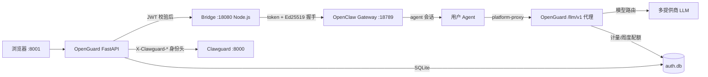

# OpenGuard — 多用户认证网关（auth-gateway）

OpenGuard 是一个面向 OpenClaw AI Agent 引擎的多租户认证与网关服务，为单用户架构提供多用户注册登录、JWT 双 Token 认证、Agent 隔离、LLM 密钥集中代理、模型管理、周度配额控制与前端管理页面。

## ✨ 新特性

- **多提供商 LLM 路由**：支持 DeepSeek、通义千问、Kimi、智谱、OpenRouter 等主流模型，按模型名自动分发到对应提供商
- **用户自由切换模型**：Dashboard 页面下拉选择模型，支持本地持久化
- **周度配额管理**：每周 token 限额三档（Free/Basic/Pro）+ 个人自定义限额，每周一零点自动重置
- **实时配额展示**：Dashboard 进度条显示"本周已用/限额"，70% 黄色预警、90% 红色告警
- **管理员配额编辑**：Admin 页面内联编辑用户配额档位和限额，即时生效
- **定时配额刷新**：前端 30 秒自动刷新配额状态
- **5 级模型路由优先级**：P1 统一端点 → P2 自部署 vLLM → P3 Claude 原生协议 → P4 国内厂商 → P5 官方前缀 → P6 OpenRouter 兜底
- **`_sanitize_messages` 消息清洗**：按 role 白名单过滤字段，防治 StepFun/阶跃等 400 报错
- **特殊模型参数白名单**：Kimi/K2.5 温度固定=1、Qwen Long 去 stream_options，自动兼容
- **原生 Claude 协议端点**：新增 `/llm/v1/messages`，直连或格式转换
- **SSE 正确响应头 + 诊断日志**：`X-Accel-Buffering: no` 防 Nginx 缓冲；错误时打印请求摘要与前 5 条消息 roles

## 1. 功能列表

| 功能 | 说明 | 状态 |
|---|---|---|
| 用户认证 | 注册/登录/刷新/登出，bcrypt 密码哈希 + JWT RS256 双 Token（access 15min / refresh 7d，refresh 支持重用检测） | ✅ 已完成 |
| 会话管理 | 会话白名单（内存/Redis 可切换）、CSRF 双提交防护、登录/注册速率限制 | ✅ 已完成 |
| SSO 登录 | 通用 OIDC/OAuth2（`SSO_ENABLED=true` 开启，支持 OIDC discovery） | ✅ 已完成 |
| Agent 多租户隔离 | 注册即创建真实 OpenClaw Agent（id 格式 `<user_id>-<slug>-<uuid8>`），所有转发请求注入 `X-Agent-Id` + HMAC 签名 | ✅ 已完成 |
| Web 聊天 | WebSocket 流式聊天，会话列表/历史复用 OpenClaw 原生 JSONL 存储 | ✅ 已完成 |
| Bridge 桥接层 | Node.js 服务：OpenClaw 持久连接（Ed25519 设备握手）、HMAC 客户端接入认证、按 session 前缀的事件隔离、agent 文件读写端点、HTTP API | ✅ 已完成 |
| **LLM 路由（4 家厂商）** | 按模型名关键字自动分发到 DeepSeek / MiniMax / GLM(智谱) / Kimi(月之暗面) | ✅ 已完成 |
| **模型管理与切换** | 前端 `<select>` 下拉选择，`localStorage` 持久化，`/me` 返回可用模型列表 | ✅ 新增 |
| **周度配额** | 每周 token 限额三档（Free/Basic/Pro），个人 `daily_token_quota` 覆盖，APScheduler 每周一零点日志触发 | ✅ 新增 |
| **配额实时展示** | Dashboard 进度条（0-100%），颜色预警，30 秒定时刷新 | ✅ 新增 |
| **管理员配额编辑** | Admin 页面内联下拉选择档位 + 输入限额 + 保存按钮，即时生效 | ✅ 新增 |
| LLM 密钥集中 | 真实 API Key 只存在于网关 `.env`，OpenClaw 侧统一走 `platform-proxy` → OpenGuard `/llm/v1` 代理 | ✅ 已完成 |
| 用量计量 | 每次模型调用记录 token 用量 + 提供商 + 成本（按 `model_pricing` 定价计算），管理员可查询 | ✅ 已完成 |
| 管理后台 | 用户角色/状态/配额管理、用量查询、Admin 路径保护 | ✅ 已完成 |
| Clawguard 对接 | 注入 `X-Clawguard-*` 身份头 + `X-Openguard-Sig` 防篡改签名 | ✅ 已完成 |
| **技能系统** | 公有/私有技能定义 + 安装指针 + 内容落盘（Bridge 写文件到 agent 工作区），完整 CRUD | ✅ 已完成 |

## 2. 系统架构



## 3. 项目结构

```
auth-gateway/
├── main.py              # FastAPI 入口：生命周期、路由挂载、APScheduler 周度配额重置
├── config.py            # 环境变量配置（含多提供商 API Key、模型列表、周度配额）
├── database.py          # SQLite 操作 + 周度配额辅助函数（get_week_start_ms）
├── auth.py              # JWT 签发验证 + 注册登录 + Agent 创建
├── middleware.py        # 认证中间件、CSRF、身份头注入与签名
├── models.py            # Pydantic 请求/响应模型
├── routes.py            # 认证/SSO/Admin/Agent/聊天历史路由（/me 返回配额+模型）
├── proxy.py             # HTTP + WS 反向代理（注入身份头）
├── llm_proxy.py         # LLM 代理：多提供商路由、周度配额检查、流式透传
├── clawguard_client.py  # Clawguard 安全检查 HTTP 客户端
├── session_store.py     # 会话白名单（内存/Redis）
├── rate_limiter.py      # 内存速率限制
├── sso.py               # 通用 OIDC/OAuth2 登录
├── skills_routes.py     # 技能系统：定义目录（公有/私有）+ 安装指针 + 内容落盘
├── seed.py              # 测试用户生成
├── bridge.js            # Node.js 桥接层（Ed25519 握手 + agent 文件读写端点）
├── templates/
│   ├── base.html        # 基础模板
│   ├── login.html       # 登录/注册页面
│   ├── dashboard.html   # 聊天页面（含配额进度条 + 模型选择器）
│   └── admin.html        # 管理后台（含配额列 + 内联编辑）
├── static/              # 前端样式
├── jwt_private.pem      # JWT RS256 私钥（本地生成，不入库）
├── jwt_public.pem       # JWT RS256 公钥（本地生成，不入库）
├── data/                # SQLite 数据库 + Bridge 设备密钥
├── requirements.txt     # Python 依赖（含 apscheduler>=3.10.0）
└── .env                 # 环境变量配置
```

## 4. 快速开始

### 4.1 安装依赖

```powershell
pip install -r requirements.txt
```

### 4.2 生成密钥对

```powershell
openssl genrsa -out jwt_private.pem 2048
openssl rsa -in jwt_private.pem -pubout -out jwt_public.pem
```

### 4.3 配置 `.env`

```env
# 服务端口
PORT=8001

# JWT（默认指向根目录的 jwt_*.pem）
JWT_PRIVATE_KEY_PATH=jwt_private.pem
JWT_PUBLIC_KEY_PATH=jwt_public.pem

# 数据库
SQLITE_PATH=./data/auth.db

# LLM 代理（多提供商 API Key，至少配置一个）
LLM_PROXY_TOKEN=a_random_token_here
OPENROUTER_API_KEY=your_openrouter_key
# 国产模型（按需要配置）
DEEPSEEK_API_KEY=your_deepseek_key
DASHSCOPE_API_KEY=your_dashscope_key       # 通义千问
MOONSHOT_API_KEY=your_moonshot_key         # Kimi
ZHIPU_API_KEY=your_zhipu_key               # GLM
MINIMAX_API_KEY=your_minimax_key
BAICHUAN_API_KEY=your_baichuan_key
DOUBAO_API_KEY=your_doubao_key             # 豆包 / 火山方舟
YI_API_KEY=your_yi_key                     # 零一万物
STEPFUN_API_KEY=your_stepfun_key           # 阶跃星辰
HUNYUAN_API_KEY=your_hunyuan_key           # 腾讯混元
# 海外模型
OPENAI_API_KEY=your_openai_key             # GPT
GOOGLE_API_KEY=your_google_key             # Gemini
XAI_API_KEY=your_xai_key                   # Grok
SILICONFLOW_API_KEY=your_siliconflow_key   # 硅基流动 国内廉价聚合
# 统一端点（P1 最高优先级，配置后覆盖所有提供商）
LLM_API_KEY=your_proxy_key
LLM_API_BASE=https://your-proxy.example.com/v1
# 自部署 vLLM/Ollama（P2 优先级）
HOSTED_VLLM_API_BASE=http://127.0.0.1:8000/v1
HOSTED_VLLM_API_KEY=
# 原生 Claude 协议直连（P3 优先级）
CLAUDE_API_BASE=
CLAUDE_API_KEY=
# ===== 技能系统（L3 签名 + 目录） =====
BRIDGE_TOKEN=change-this-in-production
CURATED_SKILLS_DIR=data/curated-skills
PLATFORM_SKILLS_DIR=data/platform-skills
SKILL_SUBMISSIONS_DIR=data/skill-submissions

# 周度配额（tokens/周）
QUOTA_FREE=140000000      # 140M/周 ≈ 20M/天
QUOTA_BASIC=7000000       # 7M/周 ≈ 1M/天
QUOTA_PRO=70000000        # 70M/周 ≈ 10M/天
QUOTA_RESET_WEEKDAY=0     # 0=周一
QUOTA_RESET_HOUR=0        # UTC 0点
QUOTA_RESET_MINUTE=0

# 默认模型（前端显示的默认值）
DEFAULT_MODEL=deepseek/deepseek-v4-flash

# 其他服务
OPENCLAW_URL=http://127.0.0.1:18789
BRIDGE_URL=ws://127.0.0.1:18080
BRIDGE_TOKEN=bridge_shared_token
CLAWGUARD_URL=http://127.0.0.1:8000
ADMIN_USERNAME=adminuser
```

### 4.4 启动

```powershell
# 启动顺序：Clawguard → OpenClaw Gateway → Bridge → OpenGuard

# 1. OpenGuard
python main.py
# 或指定端口
python -m uvicorn main:app --host 0.0.0.0 --port 8001
```

### 4.5 生成测试用户

```powershell
python seed.py -n 10 --admin adminuser
# 默认密码：test12345
```

### 4.6 访问

| 页面 | URL | 说明 |
|------|-----|------|
| 登录 | http://localhost:8001/login | 用户名/密码登录 |
| Dashboard | http://localhost:8001/dashboard | 聊天界面，配额进度条 + 模型切换 |
| Admin | http://localhost:8001/admin | 管理后台，用户配额编辑 |
| API 文档 | http://localhost:8001/docs | Swagger UI |

## 5. 配额系统

### 5.1 配额档位

| 档位 | 周度限额 | 说明 |
|------|---------|------|
| Free | 140M tokens | 免费用户，基础使用 |
| Basic | 7M tokens | 基础用户，轻量使用 |
| Pro | 70M tokens | 专业用户，大量使用 |

### 5.2 配额计算

- **统计周期**：周一 00:00 UTC 至周日 23:59:59 UTC
- **个人限额**：`users.daily_token_quota` 优先，`NULL` 时使用档位默认值
- **API 检查**：每次 LLM 请求前检查本周累计用量，超限返回 `429 Quota Exceeded`
- **重置机制**：APScheduler 每周一零点触发配额重置日志（`[Quota] Weekly quota reset triggered`）

### 5.3 前端展示

Dashboard 页面顶部展示：

```
本周配额: 1,234,567 / 140,000,000 tokens (1%)  [============        ]  5天后重置  [DeepSeek Chat ▼] [刷新]
```

- **进度条颜色**：绿色 < 70%，黄色 70-90%，红色 > 90%
- **模型选择器**：下拉切换可用模型，选择持久化到 `localStorage`
- **自动刷新**：每 30 秒调用 `/me` 更新配额显示

### 5.4 管理员操作

Admin 页面可为任意用户设置配额：

```python
PUT /api/admin/users/{user_id}/quota
Content-Type: application/json

{
  "quota_tier": "pro",
  "daily_token_quota": 100000
}
```

## 6. 模型管理

### 6.1 预置模型（4 家厂商，10 款）

在 `config.py` 的 `available_models` 中配置：

```python
available_models = [
    # DeepSeek（V4 代）
    {"id": "deepseek/deepseek-v4-pro",   "name": "DeepSeek V4 Pro"},
    {"id": "deepseek/deepseek-v4-flash", "name": "DeepSeek V4 Flash"},
    # Kimi / 月之暗面
    {"id": "kimi/kimi-k2.5",          "name": "Kimi K2.5"},
    {"id": "kimi/kimi-k2",            "name": "Kimi K2"},
    {"id": "kimi/moonshot-v1-128k",   "name": "Moonshot V1 128K"},
    # GLM / 智谱
    {"id": "glm/glm-4-plus",  "name": "GLM-4-Plus"},
    {"id": "glm/glm-4-air",   "name": "GLM-4-Air"},
    {"id": "glm/glm-4-flash", "name": "GLM-4-Flash"},
    # MiniMax
    {"id": "minimax/minimax-m2", "name": "MiniMax M2"},
    {"id": "minimax/minimax-m1", "name": "MiniMax M1"},
]
```

### 6.2 模型路由

`llm_proxy.py` 中的 `resolve_provider()` 按模型名关键字自动分发，优先级：P1 统一端点 → P2 自部署 vLLM → 4 家厂商。

| 关键字 | 提供商 | 环境变量 |
|--------|--------|---------|
| `deepseek` | DeepSeek | `DEEPSEEK_API_KEY` |
| `kimi` / `moonshot` | Kimi / 月之暗面 | `MOONSHOT_API_KEY` |
| `glm` / `zhipu` | 智谱 GLM | `ZHIPU_API_KEY` |
| `minimax` | MiniMax | `MINIMAX_API_KEY` |
| `llm-unified`（统一端点，可选） | 公司自建代理 | `LLM_API_BASE` + `LLM_API_KEY` |
| `hosted_vllm`（自部署，可选） | vLLM/Ollama | `HOSTED_VLLM_API_BASE` |

### 6.3 模型定价与成本计量

在 `config.py` 的 `model_pricing` 中按模型配置单价（元 / 1K tokens，input/output 分开）：

```python
model_pricing = {
    "deepseek/deepseek-v4-flash": {"input": 0.0005, "output": 0.002},
    "glm/glm-4-plus":             {"input": 0.005, "output": 0.005},
    # ...
}
```

- 每次调用按 `prompt_tokens`/`completion_tokens` × 单价计算成本，写入 `usage_records.cost` 与 `usage_records.provider`。
- `/me` 返回 `quota_cost_used`（本周累计成本）；`/api/admin/users` 返回 `week_cost`；`/api/admin/usage` 返回每条记录的 `provider` 与 `cost`。
- 未配置定价的模型成本记为 0；上线前请按实际价格填写 `model_pricing`。

### 6.4 添加自定义模型

1. 在 `config.py` 的 `available_models` 中添加条目
2. 若是新厂商，在 `_PROVIDER_MAP` 中添加映射
3. 在 `model_pricing` 中配置单价
4. 在 `.env` 中配置对应的 API Key

## 7. API 端点

### 认证（无需 Token）

| 方法 | 路径 | 说明 |
|------|------|------|
| `POST` | `/auth/register` | 注册新用户 |
| `POST` | `/auth/login` | 登录，返回 JWT |
| `POST` | `/auth/refresh` | 刷新 Token |
| `POST` | `/auth/logout` | 登出并销毁会话 |

### 用户（需 JWT）

| 方法 | 路径 | 说明 |
|------|------|------|
| `GET` | `/me` | **用户信息 + 配额 + 模型列表**（核心接口） |
| `GET` | `/auth/users` | 用户列表 |
| `GET` | `/api/agents` | 当前用户的 Agent 列表 |
| `GET` | `/api/agents/default` | 默认 Agent 信息 |

### 配额相关（`/me` 响应新增字段）

```json
{
  "quota_tier": "free",
  "quota_period": "weekly",
  "quota_used": 1234567,
  "quota_limit": 140000000,
  "quota_reset_at": 1787529600000,
  "default_model": "deepseek/deepseek-v4-flash",
  "available_models": [{"id": "...", "name": "...", "description": "..."}]
}
```

### Admin（需 admin JWT）

| 方法 | 路径 | 说明 |
|------|------|------|
| `GET` | `/api/admin/users` | 用户列表（含 `week_used` 周用量） |
| `PUT` | `/api/admin/users/{id}/role` | 修改角色 |
| `PUT` | `/api/admin/users/{id}/status` | 修改状态 |
| `PUT` | `/api/admin/users/{id}/quota` | **设置配额档位 + 限额** |
| `DELETE` | `/api/admin/users/{id}` | 删除用户 |
| `GET` | `/api/admin/usage` | 用量记录 |

### LLM 代理（需 `Authorization: Bearer <LLM_PROXY_TOKEN>`）

| 方法 | 路径 | 说明 |
|------|------|------|
| `POST` | `/llm/v1/chat/completions` | Chat Completions（流式/非流式） |
| `GET` | `/llm/v1/models` | 可用模型列表 |
| `GET` | `/llm/v1/health` | 代理健康检查 |

### 健康检查

| 方法 | 路径 | 说明 |
|------|------|------|
| `GET` | `/health` | 五模块状态 |

## 8. 配置说明（.env）

| 变量 | 默认值 | 说明 |
|------|--------|------|
| `PORT` | `8001` | 服务端口 |
| `SQLITE_PATH` | `./data/auth.db` | 数据库路径 |
| `JWT_PRIVATE_KEY_PATH` / `JWT_PUBLIC_KEY_PATH` | `jwt_private.pem` / `jwt_public.pem` | RS256 密钥 |
| `JWT_ACCESS_TOKEN_TTL` / `JWT_REFRESH_TOKEN_TTL` | `900` / `604800` | Token 有效期（秒） |
| `OPENCLAW_URL` | `http://127.0.0.1:18789` | OpenClaw 网关 |
| `BRIDGE_URL` | `ws://127.0.0.1:18080` | Bridge 地址 |
| `BRIDGE_TOKEN` | 空 | HMAC 共享密钥（OpenGuard 与 Bridge 必须一致） |
| `CLAWGUARD_URL` | `http://127.0.0.1:8000` | Clawguard 服务 |
| `LLM_PROXY_TOKEN` | 空 | OpenClaw → 网关代理的共享凭证 |
| `LLM_PROXY_REQUIRE_AGENT` | `false` | 为 `true` 时拒绝无法归属（缺 `X-Agent-Id`）的 LLM 请求，防止配额绕过 |
| **4 家主流提供商** | | |
| `DEEPSEEK_API_KEY` / `DEEPSEEK_BASE_URL` | 空 / `https://api.deepseek.com/v1` | DeepSeek |
| `MOONSHOT_API_KEY` / `MOONSHOT_BASE_URL` | 空 / `https://api.moonshot.cn/v1` | Kimi / 月之暗面 |
| `ZHIPU_API_KEY` / `ZHIPU_BASE_URL` | 空 / `https://open.bigmodel.cn/api/paas/v4` | 智谱 GLM |
| `MINIMAX_API_KEY` / `MINIMAX_BASE_URL` | 空 / `https://api.minimaxi.com/v1` | MiniMax（中国区端点） |
| **统一端点（可选）** | | |
| `LLM_API_KEY` / `LLM_API_BASE` | 空 / 空 | 公司自建 OpenAI 协议代理（配置后覆盖所有）|
| **自部署（可选）** | | |
| `HOSTED_VLLM_API_KEY` / `HOSTED_VLLM_API_BASE` | 空 / 空 | 本地 vLLM / Ollama |
| `DEFAULT_MODEL` | `deepseek/deepseek-v4-flash` | 默认模型 |
| `QUOTA_FREE` | `140000000` | Free 档周度限额 |
| `QUOTA_BASIC` | `7000000` | Basic 档周度限额 |
| `QUOTA_PRO` | `70000000` | Pro 档周度限额 |
| `QUOTA_RESET_WEEKDAY` | `0` | 重置星期（0=周一） |
| `QUOTA_RESET_HOUR` | `0` | 重置小时（UTC） |
| `QUOTA_RESET_MINUTE` | `0` | 重置分钟 |
| `ADMIN_USERNAME` | 空 | 该用户名注册时自动成为 admin |
| `SSO_ENABLED` | `false` | 开启通用 OIDC/OAuth2 |

## 9. 调用流程（聊天）

```text
用户输入
  ↓ 浏览器 → /chat WebSocket（带 JWT）
OpenGuard 校验 JWT + 会话 → 规范化 session key
  ↓ 连接 Bridge（agentId + ts + sig 签名参数）
Bridge 验签 → 转发 agent 消息到 OpenClaw
  ↓
OpenClaw 运行用户 Agent（session 隔离）
  ↓ Agent 调用模型
platform-proxy → OpenGuard /llm/v1（Bearer LLM_PROXY_TOKEN）
  ↓ 周度配额检查 + 多提供商路由 + 计量
对应 LLM 上游流式返回
  ↓
Bridge 按 agent:<agentId>: 前缀过滤事件
  ↓
浏览器流式展示 + 配额进度条更新
```

## 10. 依赖

| 包 | 版本 | 说明 |
|----|------|------|
| FastAPI | >=0.110 | Web 框架 |
| Uvicorn | >=0.27 | ASGI 服务器 |
| aiosqlite | >=0.20 | 异步 SQLite |
| httpx | >=0.27 | HTTP 客户端（LLM 代理） |
| websockets | >=12 | WebSocket 客户端（Bridge） |
| apscheduler | >=3.10 | 定时任务（周度配额重置） |
| python-dotenv | >=1.0 | .env 加载 |
| bcrypt | >=4.0 | 密码哈希 |
| cryptography | >=42 | JWT RS256 |
| pydantic | >=2.5 | 数据校验 |

## 11. 已知限制

- 本机无 Docker：多用户沙箱隔离方案暂不可用
- OpenClaw provider 客户端不发送 `X-Agent-Id`，无法归因的 LLM 请求目前不查配额（可设 `LLM_PROXY_REQUIRE_AGENT=true` 强制拒绝无法归因请求）
- 修改 OpenClaw 的 `auth-profiles.json` / `models.json` 后需重启网关进程
- Bridge 必须先于 OpenClaw 就绪前启动，否则握手失败（稍后自动重连）
- 技能系统：一个 skill 目前对应单个 `SKILL.md`（单 `content` 字段），多文件 skill 包暂不支持
- 技能安装/卸载依赖 Bridge 文件端点，需重启 `bridge.js` 生效；OpenGuard 与 Bridge 必须共用同一 `BRIDGE_TOKEN`

## 12. 备份与恢复

原始版本备份在 `../auth-gateway-backup/`，恢复时可直接复制覆盖。


## 🧠 技能系统（公有/私有 + 内容落盘）

### 数据模型（两张表）

| 表 | 作用 | 关键字段 |
|----|------|---------|
| `skills` | 技能**定义**，内容只存一次 | `visibility`(public/private) + `owner_user_id`(私有必填、公有 NULL) + `content_hash` |
| `agent_skills` | **安装关系**（指针），不复制内容 | `skill_id` → `skills.id`，`UNIQUE(agent_id, skill_name)` |

- **公有 / 私有只差一个字段**：私有 skill 带 `owner_user_id`，公有 skill 为 `NULL`（管理员创建）。
- **相同内容只存一次**：安装时只写一条 `agent_skills` 指针，指向 `skills` 里的定义，不重复存储内容。
- 不做精选商店/审核流；`content_hash` 用于内容指纹与后续去重。

### 内容落盘

安装时，OpenGuard 通过 Bridge 把 `SKILL.md` 写入 agent 工作区，OpenClaw agent 从工作区 `skills/` 目录自动发现并加载：

```
~/.openclaw/workspace-<agentId>/skills/<name>/SKILL.md
```

- Bridge 端点：`PUT/DELETE /api/agents/{agentId}/files/{path}`（`X-Bridge-Token` 认证 + `sanitizePath` 防路径穿越）。
- 技能名限制：`^[A-Za-z0-9][A-Za-z0-9_-]*$`（必须能作为安全目录名）。
- 安装 = 先写文件 → 再写 DB；卸载/删定义 = 删文件 + 删记录（文件清理为尽力而为）。

### 用户 API（已登录）

| 方法 | 端点 | 说明 |
|------|------|------|
| GET | `/api/skills/catalog` | 公有 + 我的私有，标注 installed + install_count |
| GET | `/api/skills/catalog/{id}` | 查看单个定义（含内容）|
| PUT | `/api/skills/catalog/{id}` | 编辑我的私有定义（description/version/content）|
| POST | `/api/skills` | 建私有定义 + 安装（写文件 + 写 DB）|
| POST | `/api/skills/catalog/{id}/install` | 安装目录技能到默认 agent（公有任意/私有仅 owner）|
| DELETE | `/api/skills/catalog/{id}` | 删除我的私有定义（级联 + 清理文件）|
| GET/PUT/DELETE | `/api/skills[/{name}]` | 安装记录查询/更新/卸载 |

### 管理员 API

| 方法 | 端点 | 说明 |
|------|------|------|
| POST | `/api/admin/skills` | 建/更新公有技能定义 |
| GET | `/api/admin/skills/catalog` | 全量定义 + 安装次数 |
| DELETE | `/api/admin/skills/catalog/{id}` | 删除任意定义（级联 + 清理文件）|
| GET/DELETE | `/api/admin/skills[/{id}]` | 安装记录管理 |
